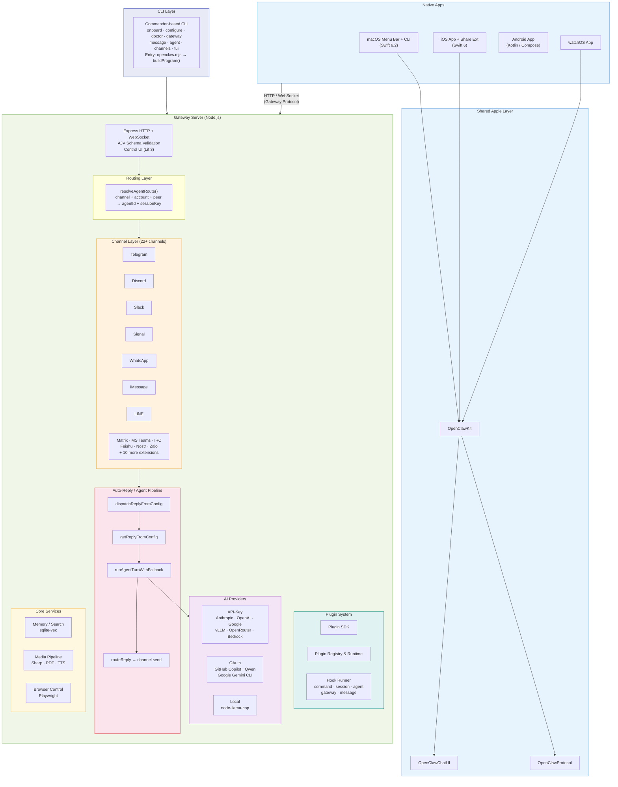
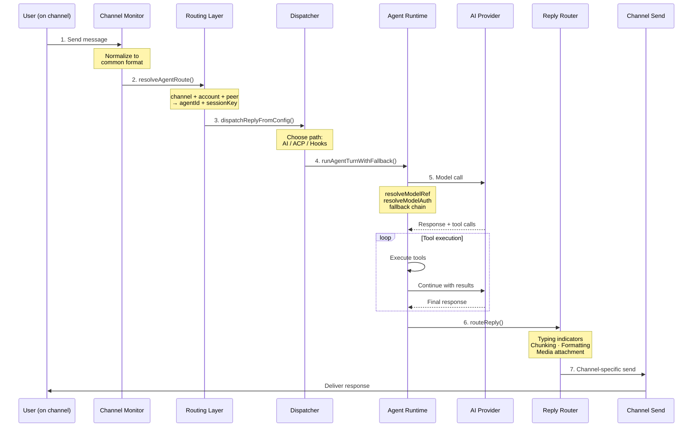
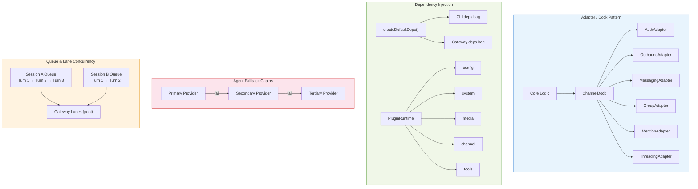
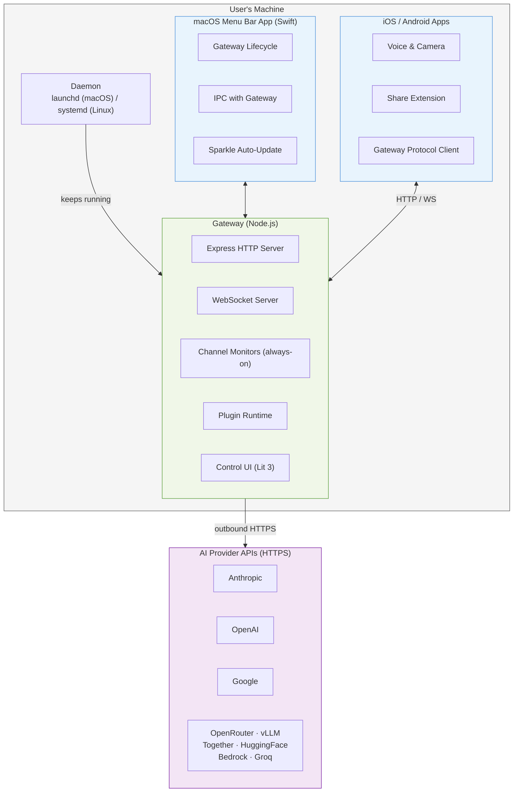
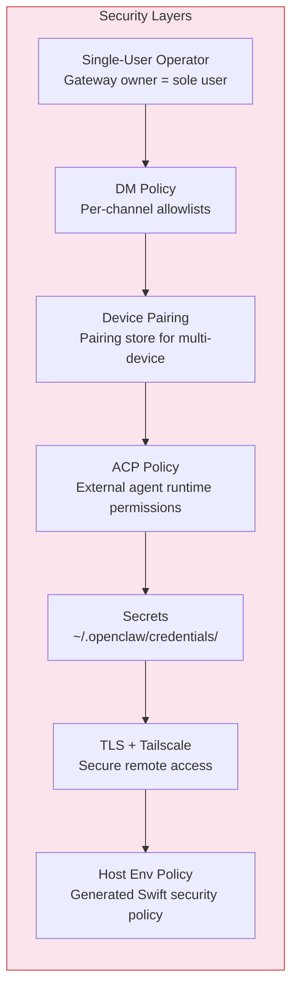

# OpenClaw Architecture Analysis

## 1. What Is OpenClaw?

OpenClaw is a **self-hosted, single-user personal AI assistant** that runs on your own
devices and answers you across the messaging channels you already use — WhatsApp,
Telegram, Slack, Discord, Signal, iMessage, Google Chat, IRC, Matrix, Microsoft Teams,
LINE, and 10+ more. It can speak and listen on macOS/iOS/Android and renders a live
Canvas you control. The Gateway is the control plane; the product is the assistant.

**Core thesis:** a local, fast, always-on assistant that runs real tasks on a real
computer, with security as a deliberate tradeoff — strong defaults without killing
capability.

---

## 2. High-Level Architecture

---

## 3. Module Map

### Core source (`src/`) — 55+ subdirectories

```mermaid
graph LR
    subgraph EntryPoints["Entry Points"]
        entry["entry.ts"]
        index["index.ts"]
        cli["cli/"]
        commands["commands/"]
    end

    subgraph GatewayLayer["Gateway"]
        gateway["gateway/"]
        routing["routing/"]
        channels["channels/"]
    end

    subgraph AgentLayer["Agent System"]
        agents["agents/"]
        acp["acp/"]
        autoreply["auto-reply/"]
    end

    subgraph PluginLayer["Plugin System"]
        plugins["plugins/"]
        pluginSDK["plugin-sdk/"]
        hooks["hooks/"]
    end

    subgraph Infrastructure["Infrastructure"]
        config["config/"]
        infra["infra/"]
        daemon["daemon/"]
        security["security/"]
        pairing["pairing/"]
        logging["logging/"]
    end

    subgraph Processing["Processing"]
        media["media/"]
        mediaU["media-understanding/"]
        memory["memory/"]
        browser["browser/"]
        tts["tts/"]
    end

    subgraph ChannelImpls["Channel Implementations"]
        telegram["telegram/"]
        discord["discord/"]
        slack["slack/"]
        signal["signal/"]
        imessage["imessage/"]
        web["web/ (WhatsApp)"]
        line["line/"]
    end

    EntryPoints --> GatewayLayer
    GatewayLayer --> AgentLayer
    AgentLayer --> PluginLayer
    GatewayLayer --> ChannelImpls
    AgentLayer --> Processing
    GatewayLayer --> Infrastructure

    style EntryPoints fill:#e8eaf6,stroke:#3f51b5
    style GatewayLayer fill:#f0f7e8,stroke:#5a9e3a
    style AgentLayer fill:#fce4ec,stroke:#d32f2f
    style PluginLayer fill:#e0f2f1,stroke:#00897b
    style Infrastructure fill:#f5f5f5,stroke:#9e9e9e
    style Processing fill:#fff8e1,stroke:#f9a825
    style ChannelImpls fill:#fff3e0,stroke:#e8a030
```

| Module | Responsibility |
|--------|----------------|
| `cli/` | Commander program builder, command registry, deps injection |
| `commands/` | High-level commands: onboard, configure, doctor, auth-choice |
| `gateway/` | HTTP/WS server, protocol schema (AJV), control UI, server lanes |
| `routing/` | Route resolution: (channel, account, peer) → (agentId, sessionKey) |
| `channels/` | Channel registry, dock, allowlists, plugin channel interface |
| `auto-reply/` | Reply pipeline: templating, dispatch, routing, chunking |
| `agents/` | Agent runtime: model config, auth, selection, fallback, tools, Pi runner |
| `acp/` | Agent Control Protocol runtime, session, events |
| `plugins/` | Plugin registry, runtime, services, hook runner |
| `plugin-sdk/` | Public SDK for extension authors |
| `config/` | Config loading, schema, migrations, sessions |
| `infra/` | Binaries, ports, env detection, TLS, state, heartbeat |
| `media/` | MIME detection, media store, fetch, image operations |
| `media-understanding/` | Vision/audio understanding via providers |
| `memory/` | Memory/search, embeddings, sqlite-vec |
| `browser/` | Playwright-based browser control, routes, screenshots |
| `pairing/` | Device pairing and pairing store |
| `security/` | DM policy, ACP policy |
| `hooks/` | Internal hooks and bundled hook handlers |
| `tts/` | Text-to-speech (edge-tts) |
| `tui/` | Terminal UI components and theme |
| `terminal/` | Table rendering, CLI palette |
| `logging/` | Logging subsystem (tslog) |
| `daemon/` | Daemon/service management (launchd/systemd) |
| `cron/` | Cron job scheduling |
| `process/` | Process exec, supervisor, command queue |
| `wizard/` | Onboarding wizard flow |

### Channel modules (built-in)

Each channel follows a consistent pattern: monitor, inbound handler, send, API helpers.

| Channel | Key files |
|---------|-----------|
| `telegram/` | Grammy-based; monitor, process inbound, send |
| `discord/` | Carbon-based; monitor, preprocess, send, voice |
| `slack/` | Bolt-based; monitor, prepare message |
| `signal/` | Signal CLI bridge; monitor, event handler |
| `imessage/` | Native macOS; monitor, send, probe |
| `web/` | WhatsApp via Baileys; monitor inbox, message handler |
| `line/` | LINE SDK; monitor, send, flex templates |

---

## 4. Data Flow — Message Lifecycle

---

## 5. Key Design Patterns

### 5.1 Adapter / Dock Pattern
Each channel exposes capabilities through a `ChannelDock` that wraps typed adapters
(Auth, Outbound, Messaging, Group, Mentions, Threading). Core logic queries the dock
without knowing which channel it is.

### 5.2 Dependency Injection
`createDefaultDeps()` builds a dependency bag passed through the CLI and gateway.
Plugins receive a `PluginRuntime` with config, system, media, channel, and tool access.

### 5.3 Routing by Session Key
Sessions are scoped to (channel + account + peer). `resolveAgentRoute` resolves this
triple to an agentId and sessionKey, supporting per-guild, per-team, and per-account
bindings.

### 5.4 Agent Fallback Chains
`runAgentTurnWithFallback` supports model/provider fallback: if the primary provider
fails, it retries with the next in the chain. Auth rotation (OAuth vs API key profiles)
is handled transparently.

### 5.5 Plugin Lifecycle
Plugins declare `openclaw.plugin.json` with id, channels, kind, and config schema.
The gateway loads plugins at startup via `loadGatewayPlugins()`. Plugins hook into
the lifecycle via the hook system (command, session, agent, gateway, message events).

### 5.6 Protocol Schema Validation
The Gateway protocol uses JSON frames validated by AJV schemas. Request/response/event
frames are strongly typed and generated from TypeScript (with Swift codegen for native
apps via `protocol-gen-swift.ts`).

### 5.7 Queue and Lane Concurrency
Per-session command queues and gateway lanes control concurrency, preventing message
interleaving and ensuring ordered processing per conversation.

---

## 6. Deployment Topology

---

## 7. Security Model

- **Single-user, operator-controlled:** The gateway owner is the sole user and operator.
- **DM policy:** Configurable per-channel allowlists control who can message the assistant.
- **Pairing:** Device pairing with pairing store for multi-device access.
- **ACP policy:** Controls external agent runtime permissions.
- **Secrets:** Runtime secrets snapshot; credentials stored at `~/.openclaw/credentials/`.
- **TLS:** Optional TLS for gateway; Tailscale integration for secure remote access.
- **Host env policy:** Generated Swift security policy for native apps.
