# OpenClaw Design Patterns & Pipelines

## 1. Messaging Pipeline — Full Trace

### 1.1 Inbound Path

Every channel implements a **monitor** function that starts the channel connection
and registers event handlers:

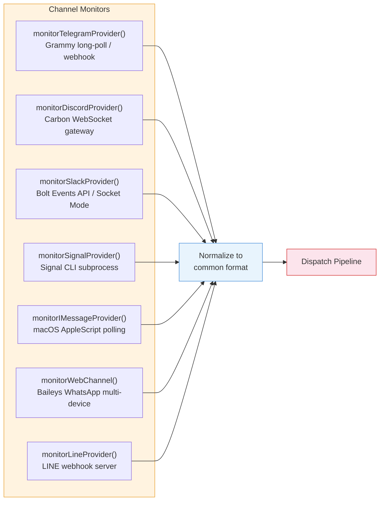

Each monitor normalizes the incoming message into a common format and invokes
the dispatch pipeline.

### 1.2 Routing

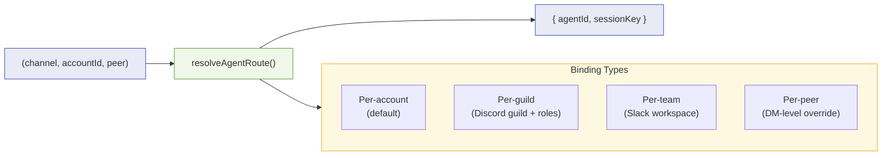

The routing layer resolves which agent and session should handle a message.
Session keys are scoped as `channel:account:peer`.

### 1.3 Dispatch

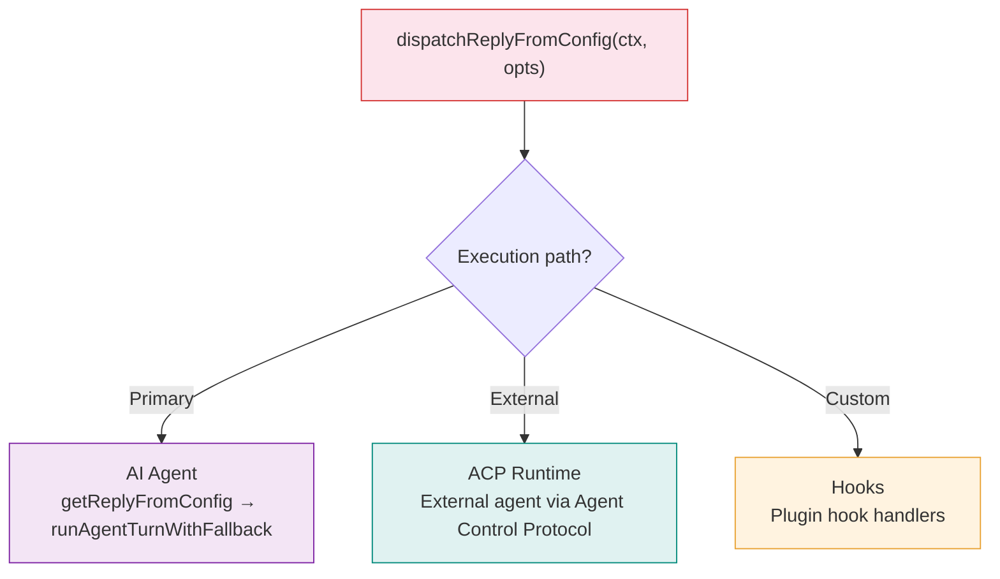

### 1.4 Agent Execution

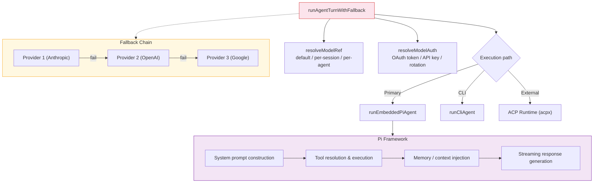

**Fallback chain:** If the primary model/provider fails (rate limit, auth error,
network), the system retries with the next provider in the fallback chain defined
in the models config.

### 1.5 Reply Routing

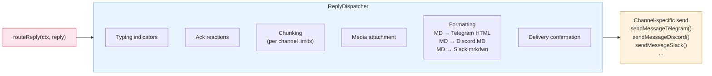

---

## 2. Plugin System Architecture

### 2.1 Plugin Definition

Each plugin is defined by two files:

**`openclaw.plugin.json`** — Metadata and config schema:
```json
{
  "id": "my-plugin",
  "channels": ["my-channel"],
  "kind": "channel",
  "configSchema": { ... },
  "uiHints": { ... }
}
```

**`package.json`** — Entry points and dependencies:
```json
{
  "openclaw": {
    "extensions": { "./index.ts": "..." },
    "channel": {
      "id": "my-channel",
      "label": "My Channel",
      "aliases": ["mc"]
    }
  }
}
```

### 2.2 Plugin Types

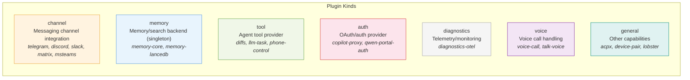

### 2.3 Plugin Lifecycle

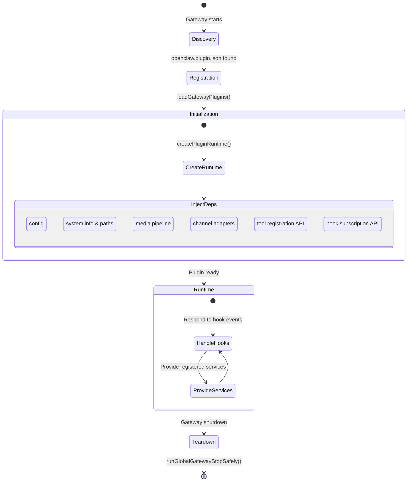

### 2.4 Channel Plugin Adapters

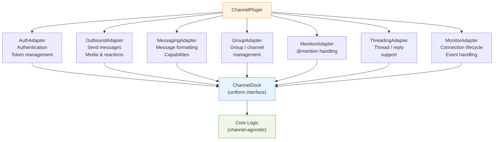

These adapters are wrapped by `ChannelDock`, which provides a uniform interface
for core logic to query channel capabilities without channel-specific code.

### 2.5 Hook System

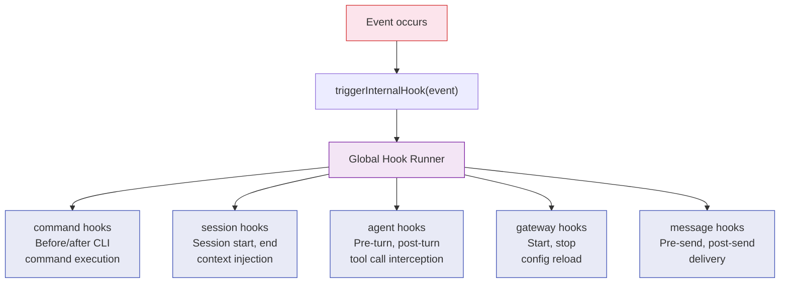

---

## 3. Gateway Protocol

### 3.1 Transport & Frame Types

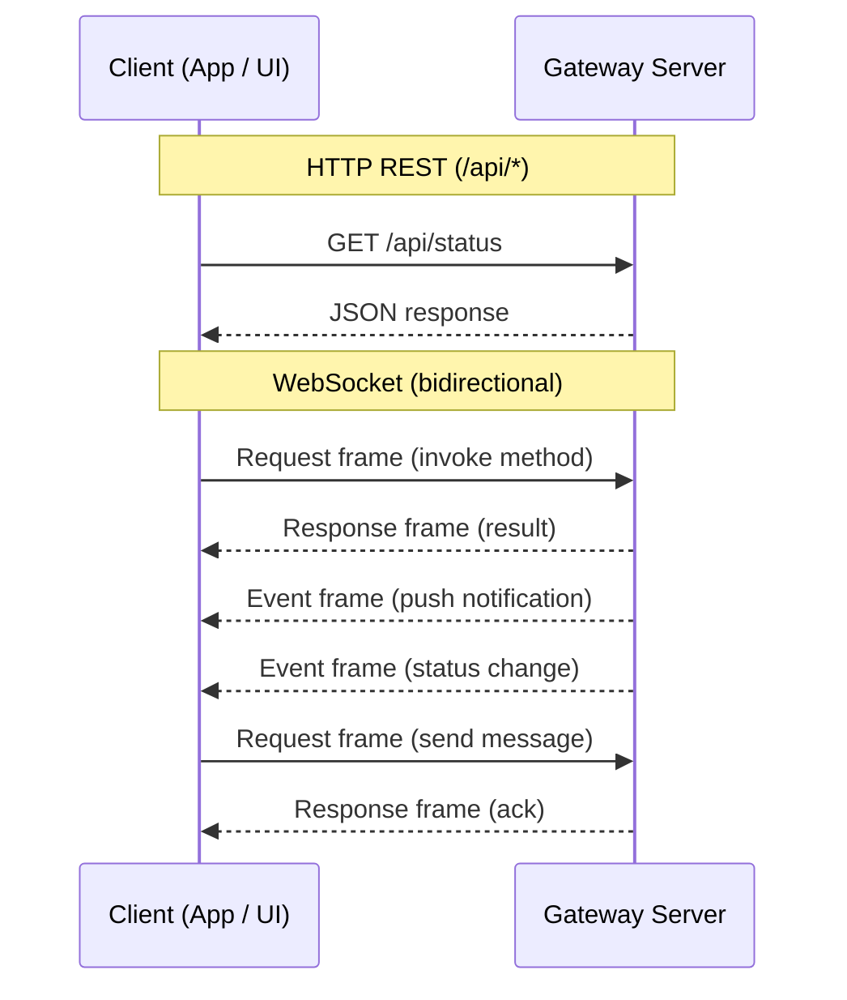

All WebSocket communication uses JSON frames validated by AJV schemas.

### 3.2 Protocol Codegen

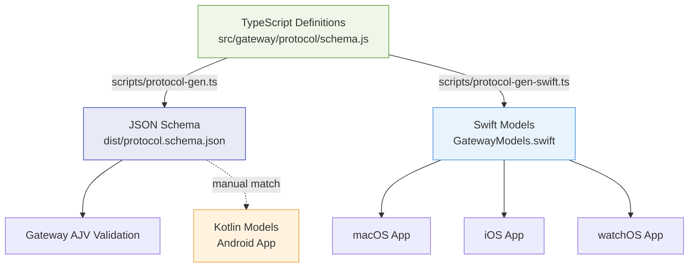

This ensures native apps and the gateway always speak the same protocol.

---

## 4. Configuration System

### 4.1 Config Loading

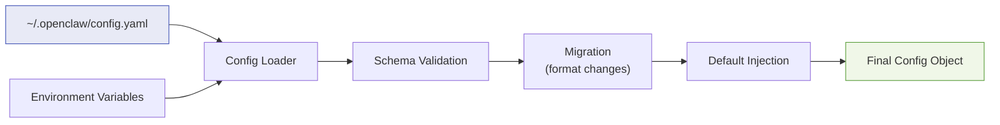

### 4.2 Config Scopes

| Scope | Controls |
|-------|----------|
| **gateway** | Port, bind address, mode (local/remote), TLS |
| **channels** | Per-channel enable/disable, credentials, allowlists |
| **models** | Default model, provider configs, auth profiles, fallback chains |
| **agents** | Agent definitions, session routing bindings |
| **security** | DM policy, ACP policy, pairing |
| **plugins** | Per-plugin config matching their declared schema |

---

## 5. Concurrency Model

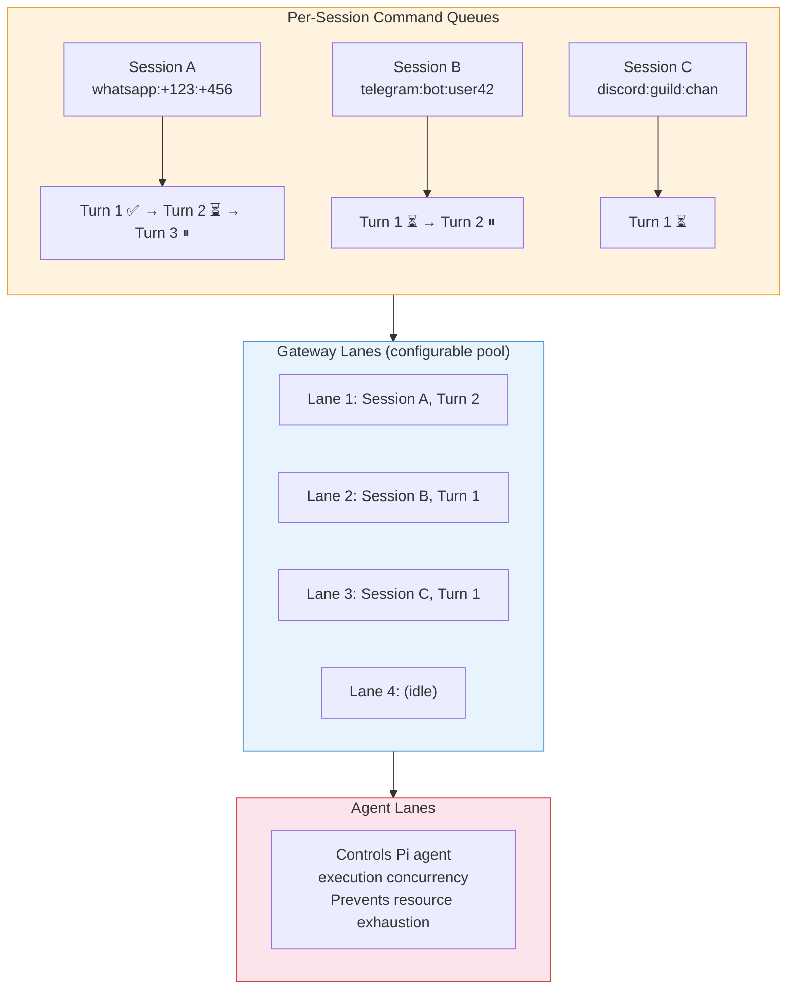

Per-session command queues serialize turns within a session, gateway lanes
control overall concurrency, and agent lanes prevent resource exhaustion.

---

## 6. Memory & Search

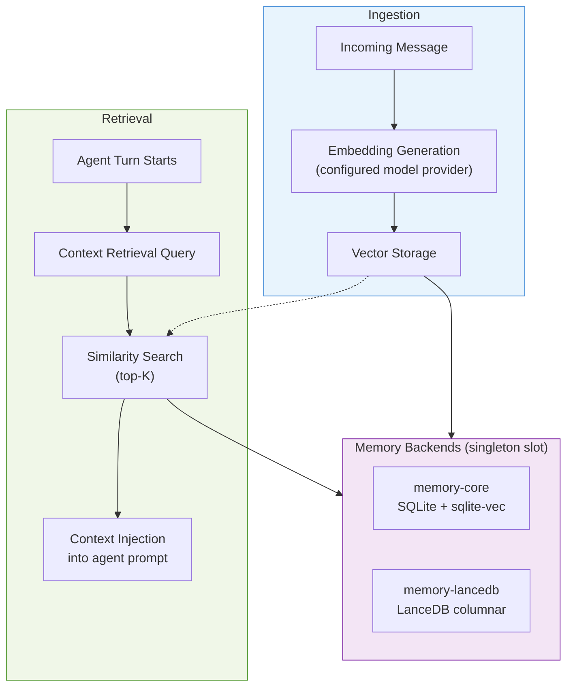

---

## 7. Media Pipeline

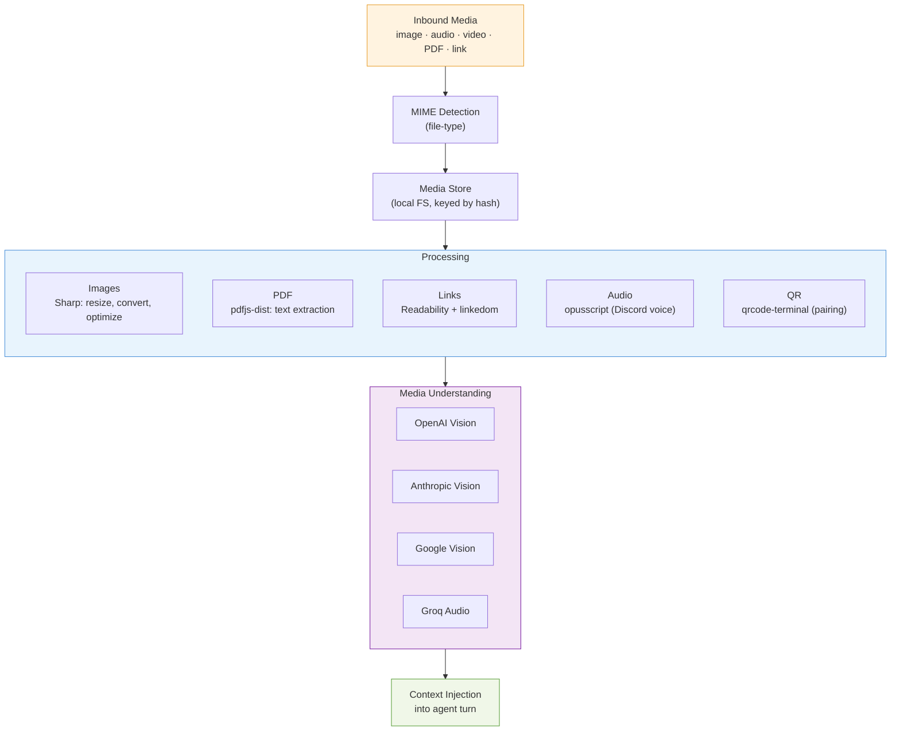

---

## 8. Cross-Platform Protocol Sharing

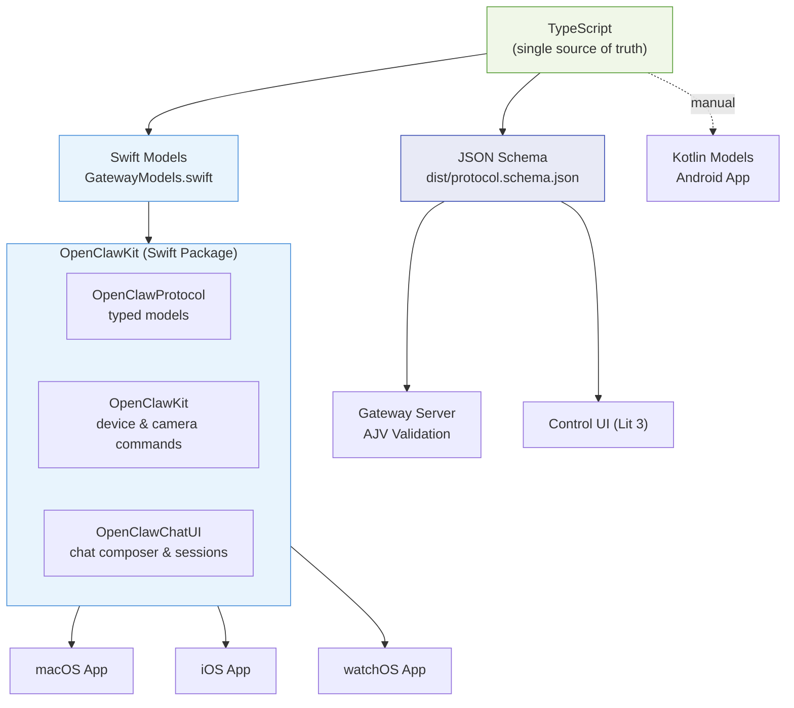

---

## 9. Extension Catalog (35+ plugins)

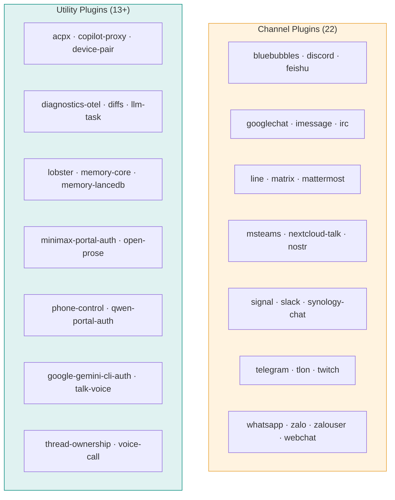

---

## 10. Key Architectural Decisions

| Decision | Rationale |
|----------|-----------|
| **TypeScript over Python/Go** | Orchestration system; hackability, ecosystem breadth, fast iteration |
| **Single-user, self-hosted** | Privacy-first; operator controls all data and permissions |
| **Channel-agnostic core** | Dock/adapter pattern lets core logic work without channel-specific code |
| **Plugin-first for optionality** | Core stays lean; capabilities ship as plugins |
| **CalVer versioning** | Date-based versions communicate freshness over semver compat promises |
| **Pi framework for agents** | Embedded agent runtime with tool use, memory, streaming |
| **Protocol codegen** | Single source of truth prevents native app / gateway protocol drift |
| **Lit over React** | Lightweight web components for the control UI; no heavy SPA framework |
| **Express 5 over Fastify** | Mature, well-known, sufficient for single-user gateway workload |
| **pnpm monorepo** | Workspace support, strict dependency resolution, disk efficiency |
| **Oxlint + Oxfmt over ESLint + Prettier** | Faster Rust-based tooling; unified lint + format pipeline |
