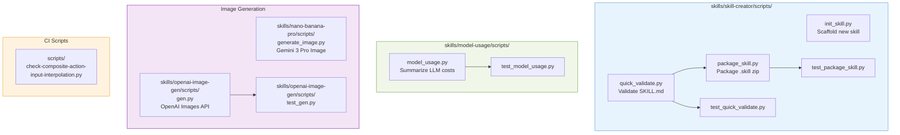
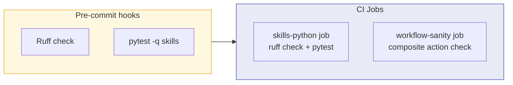
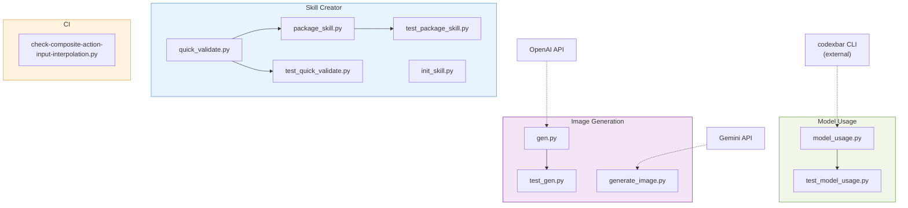

# Python Files Analysis

OpenClaw is primarily TypeScript. Python is used only for **skills tooling**, **image generation scripts**, and **one CI lint script**. There are 11 Python files total.

## Overview

## Dependency & Test Setup

- **Python version:** >=3.10
- **Config:** `pyproject.toml` (repo root) — Ruff linter + pytest config
- **No `requirements.txt`** — deps are either stdlib-only or declared via inline PEP 723
- **Test runner:** `pytest -q skills` (in CI and pre-commit)
- **Linter:** Ruff (`ruff check skills`)

---

## 1. `skills/skill-creator/scripts/quick_validate.py` — Skill Validator

| Function | Signature | Purpose |
|----------|-----------|---------|
| `_extract_frontmatter` | `(content: str) => str \| None` | Extract YAML frontmatter between `---` fences |
| `_parse_simple_frontmatter` | `(frontmatter_text: str) => dict` | Fallback YAML parser when PyYAML is absent |
| `validate_skill` | `(skill_path: Path) => list[str]` | Validates `SKILL.md`: frontmatter, allowed fields, name/description rules, hyphen-case naming, length limits |

**Invocation:**
- CLI: `python quick_validate.py <skill_directory>`
- Imported by: `package_skill.py`, `test_quick_validate.py`

**Dependencies:** `re`, `sys`, `pathlib`, `typing`; optional `yaml` (PyYAML)

---

## 2. `skills/skill-creator/scripts/package_skill.py` — Skill Packager

| Function | Signature | Purpose |
|----------|-----------|---------|
| `_is_within` | `(path: Path, root: Path) => bool` | Checks path is under root (security) |
| `package_skill` | `(skill_path: Path, output_dir: Path) => Path` | Zips skill folder to `.skill` (excludes `.git`, symlinks, rejects path traversal) |
| `main` | `() => None` | CLI entry |

**Invocation:**
- CLI: `python package_skill.py <skill-folder> [output-dir]`
- Imported by: `test_package_skill.py`

**Dependencies:** `sys`, `zipfile`, `pathlib`; imports `quick_validate.validate_skill`

---

## 3. `skills/skill-creator/scripts/init_skill.py` — Skill Scaffolder

| Function | Signature | Purpose |
|----------|-----------|---------|
| `normalize_skill_name` | `(skill_name: str) => str` | Convert to hyphen-case |
| `title_case_skill_name` | `(skill_name: str) => str` | Convert to Title Case |
| `parse_resources` | `(raw_resources: str) => list[str]` | Parse resource types (scripts/references/assets) |
| `create_resource_dirs` | `(skill_dir, skill_name, skill_title, resources, include_examples) => None` | Create dirs with optional example files |
| `init_skill` | `(skill_name, path, resources, include_examples) => None` | Scaffold a new skill with `SKILL.md` template |
| `main` | `() => None` | CLI entry |

**Invocation:** CLI: `python init_skill.py <skill_name> [--path DIR] [--resources scripts,assets] [--examples]`

**Dependencies:** `argparse`, `re`, `sys`, `pathlib`

---

## 4. `skills/skill-creator/scripts/test_quick_validate.py` — Validator Tests

| Test | Purpose |
|------|---------|
| `test_accepts_crlf_frontmatter` | CRLF line endings in frontmatter are accepted |
| `test_rejects_missing_frontmatter_closing_fence` | Missing closing `---` fence is rejected |
| `test_fallback_parser_handles_multiline_frontmatter_without_pyyaml` | Fallback parser works without PyYAML installed |

**Invocation:** `pytest skills` (CI + pre-commit)

---

## 5. `skills/skill-creator/scripts/test_package_skill.py` — Packager Security Tests

| Test | Purpose |
|------|---------|
| `test_packages_normal_files` | Normal files are packaged correctly |
| `test_skips_symlink_to_external_file` | Symlinks to external files are skipped |
| `test_skips_symlink_directory` | Symlink directories are skipped |
| `test_rejects_resolved_path_outside_skill_root` | Path traversal attacks are rejected |
| `test_allows_nested_regular_files` | Nested regular files are allowed |
| `test_skips_output_archive_when_output_dir_is_skill_dir` | Archive self-inclusion is prevented |

**Invocation:** `pytest skills` (CI + pre-commit)

---

## 6. `skills/model-usage/scripts/model_usage.py` — LLM Cost Summarizer

| Function | Signature | Purpose |
|----------|-----------|---------|
| `positive_int` | `(value: str) => int` | argparse type validator |
| `eprint` | `(msg: str) => None` | Print to stderr |
| `run_codexbar_cost` | `(provider: str) => dict` | Run `codexbar cost --format json` subprocess |
| `load_payload` | `(input_path, provider) => dict` | Load from file, stdin, or codexbar |
| `ModelCost` | `@dataclass` | Model cost data structure |
| `parse_daily_entries` | `(payload: dict) => list[ModelCost]` | Parse daily cost entries |
| `parse_date` | `(value: str) => date` | Parse date string |
| `filter_by_days` | `(entries, days) => list[ModelCost]` | Filter entries by recent N days |
| `aggregate_costs` | `(entries) => dict` | Aggregate costs by model |
| `pick_current_model` | `(entries) => str` | Pick most recently used model |
| `usd` | `(value: float) => str` | Format as USD |
| `latest_day_cost` | `(entries, model) => float` | Cost for latest day |
| `render_text_current` | `(...) => str` | Text output for current model |
| `render_text_all` | `(provider, totals) => str` | Text output for all models |
| `build_json_current` | `(...) => dict` | JSON output for current model |
| `build_json_all` | `(provider, totals) => dict` | JSON output for all models |
| `main` | `() => int` | CLI entry |

**Invocation:** CLI: `python model_usage.py --provider codex|claude [--mode current|all] [--days N] [--format text|json]`

**Dependencies:** `argparse`, `json`, `os`, `subprocess`, `sys`, `dataclasses`, `datetime`, `typing`

**External tool:** `codexbar` (must be on PATH)

---

## 7. `skills/model-usage/scripts/test_model_usage.py` — Cost Summarizer Tests

| Test | Purpose |
|------|---------|
| `test_positive_int_accepts_valid_numbers` | Valid positive integers accepted |
| `test_positive_int_rejects_zero_and_negative` | Zero and negatives rejected |
| `test_filter_by_days_keeps_recent_entries` | Date filtering works correctly |

**Invocation:** `pytest skills`

---

## 8. `skills/nano-banana-pro/scripts/generate_image.py` — Gemini Image Generation

| Function | Signature | Purpose |
|----------|-----------|---------|
| `get_api_key` | `(provided_key: str \| None) => str` | Get key from arg or `GEMINI_API_KEY` env var |
| `main` | `() => None` | Generate or edit images via Gemini 3 Pro Image |

**Invocation:** CLI via `uv run`: `uv run generate_image.py --prompt "..." [--input-image img.png] [--resolution 1K|2K|4K]`

**Dependencies (inline PEP 723):**
- `google-genai>=1.0.0`
- `pillow>=10.0.0`

**Environment variables:** `GEMINI_API_KEY`

**CLI args:** `--prompt`, `--filename`, `--input-image` (multiple, up to 14), `--resolution 1K|2K|4K`, `--api-key`

---

## 9. `skills/openai-image-gen/scripts/gen.py` — OpenAI Image Generation

| Function | Signature | Purpose |
|----------|-----------|---------|
| `slugify` | `(text: str) => str` | Filename-safe slug |
| `default_out_dir` | `() => Path` | `~/Projects/tmp` or `./tmp` |
| `pick_prompts` | `(count: int) => list[str]` | Random prompt combinations |
| `get_model_defaults` | `(model: str) => dict` | Default size/quality per model |
| `request_images` | `(api_key, prompt, model, size, quality, ...) => list` | Call OpenAI Images API |
| `write_gallery` | `(out_dir, items) => None` | Build `index.html` gallery (XSS-safe) |
| `main` | `() => int` | CLI entry |

**Invocation:** CLI: `python gen.py --prompt "..." [--count N] [--model gpt-image-1] [--out-dir DIR]`

**Dependencies:** `argparse`, `base64`, `datetime`, `json`, `os`, `random`, `re`, `sys`, `urllib`, `html`, `pathlib`

**Environment variables:** `OPENAI_API_KEY`

**CLI args:** `--prompt`, `--count`, `--model`, `--size`, `--quality`, `--background`, `--output-format`, `--style`, `--out-dir`

---

## 10. `skills/openai-image-gen/scripts/test_gen.py` — Gallery XSS Tests

| Test | Purpose |
|------|---------|
| `test_write_gallery_escapes_prompt_xss` | XSS in prompts is escaped |
| `test_write_gallery_escapes_filename` | XSS in filenames is escaped |
| `test_write_gallery_escapes_ampersand` | Ampersands are properly escaped |
| `test_write_gallery_normal_output` | Normal output renders correctly |

**Invocation:** `pytest skills`

---

## 11. `scripts/check-composite-action-input-interpolation.py` — CI Lint Script

| Function | Signature | Purpose |
|----------|-----------|---------|
| `indentation` | `(line: str) => int` | Count leading spaces |
| `scan_file` | `(path: Path) => list[tuple[int, str]]` | Find `${inputs.*}` in composite action `run:` blocks |
| `main` | `() => int` | Scan `.github/actions` and exit non-zero on violations |

**Invocation:** CI workflow `workflow-sanity.yml`: `python3 scripts/check-composite-action-input-interpolation.py`

**Purpose:** Enforces that composite GitHub Action `run:` blocks use `env:` + shell variables instead of direct `${inputs.*}` interpolation (prevents injection).

**Dependencies:** `pathlib`, `re`, `sys` (stdlib only)

---

## Environment Variables Summary

| Variable | File | Purpose |
|----------|------|---------|
| `GEMINI_API_KEY` | `generate_image.py` | Google Gemini API auth |
| `OPENAI_API_KEY` | `gen.py` | OpenAI API auth |

---

## File Dependency Graph

---

## Categorization

| Category | Files | Purpose |
|----------|-------|---------|
| **Skill tooling** | `quick_validate.py`, `package_skill.py`, `init_skill.py` + tests | Scaffold, validate, and package OpenClaw skills |
| **LLM cost analysis** | `model_usage.py` + test | Summarize model usage costs from CodexBar |
| **Image generation** | `generate_image.py`, `gen.py` + test | Generate images via Gemini / OpenAI APIs |
| **CI enforcement** | `check-composite-action-input-interpolation.py` | Prevent `${inputs.*}` injection in composite actions |
