# OpenClaw Technology Stack Deep-Dive

## 1. Language & Runtime

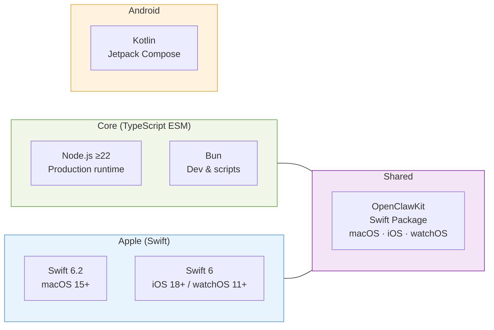

| Layer | Technology | Notes |
|-------|-----------|-------|
| **Primary language** | TypeScript (ESM) | Strict typing, no `any` |
| **Runtime** | Node.js ≥22 | Production runtime; built output in `dist/` |
| **Alt runtime** | Bun | Supported for dev/scripts; `bun <file.ts>` / `bunx` |
| **Native apps** | Swift 6.2 (macOS/iOS/watchOS), Kotlin + Jetpack Compose (Android) | |
| **Shared Apple lib** | OpenClawKit (Swift Package) | Shared across macOS, iOS, watchOS |

---

## 2. Build System & Tooling

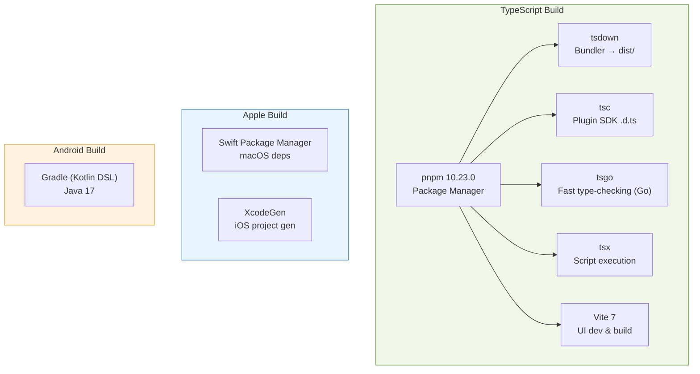

| Tool | Role | Config |
|------|------|--------|
| **pnpm** (10.23.0) | Package manager | `pnpm-workspace.yaml` — monorepo: root, `ui/`, `packages/*`, `extensions/*` |
| **tsdown** | TypeScript bundler → `dist/` | `tsdown.config.ts` — multi-entry (index, entry, daemon-cli, plugin-sdk, hooks) |
| **tsc** | Type declarations for plugin SDK | `tsconfig.plugin-sdk.dts.json` |
| **tsgo** (`@typescript/native-preview`) | Fast type-checking | Native TS checker (Go-based, experimental) |
| **tsx** | TS execution for scripts | `node --import tsx scripts/*.ts` |
| **Vite 7** | UI dev server & build | `ui/vite.config.ts` |
| **XcodeGen** | iOS project generation | `apps/ios/project.yml` |
| **Swift Package Manager** | macOS app dependencies | `apps/macos/Package.swift` |
| **Gradle** (Kotlin DSL) | Android build | `apps/android/build.gradle.kts` |

---

## 3. Linting & Formatting

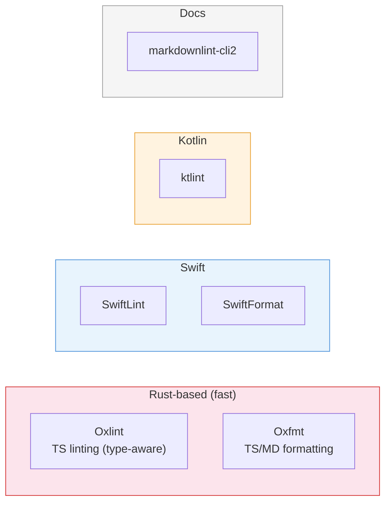

| Tool | Scope | Command |
|------|-------|---------|
| **Oxlint** | TypeScript linting (type-aware) | `pnpm lint` → `oxlint --type-aware` |
| **Oxfmt** | TypeScript/Markdown formatting | `pnpm format` → `oxfmt --write` |
| **SwiftLint** | Swift linting | `pnpm lint:swift` |
| **SwiftFormat** | Swift formatting | `pnpm format:swift` |
| **ktlint** | Kotlin linting/formatting | `pnpm android:lint` / `pnpm android:format` |
| **markdownlint-cli2** | Docs markdown | `pnpm lint:docs` |

---

## 4. Testing Infrastructure

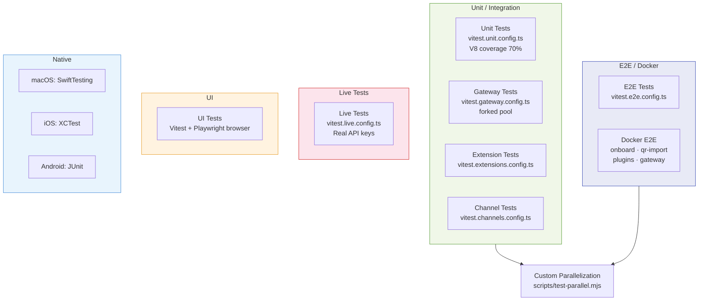

| Layer | Framework | Config |
|-------|-----------|--------|
| **Unit tests** | Vitest + V8 coverage (70% threshold) | `vitest.unit.config.ts` |
| **Gateway tests** | Vitest (forked pool) | `vitest.gateway.config.ts` |
| **Extension tests** | Vitest | `vitest.extensions.config.ts` |
| **Channel tests** | Vitest | `vitest.channels.config.ts` |
| **E2E tests** | Vitest + Docker scripts | `vitest.e2e.config.ts`, `scripts/e2e/*.sh` |
| **Live tests** | Vitest with real API keys | `vitest.live.config.ts` |
| **UI tests** | Vitest + Playwright browser | `ui/vitest.config.ts` |
| **Parallelization** | Custom `scripts/test-parallel.mjs` | Isolated file lists for heavy suites |
| **macOS** | SwiftTesting | `OpenClawIPCTests` |
| **iOS** | XCTest | `OpenClawTests` |
| **Android** | JUnit | `./gradlew :app:testDebugUnitTest` |

---

## 5. Messaging Channel SDKs

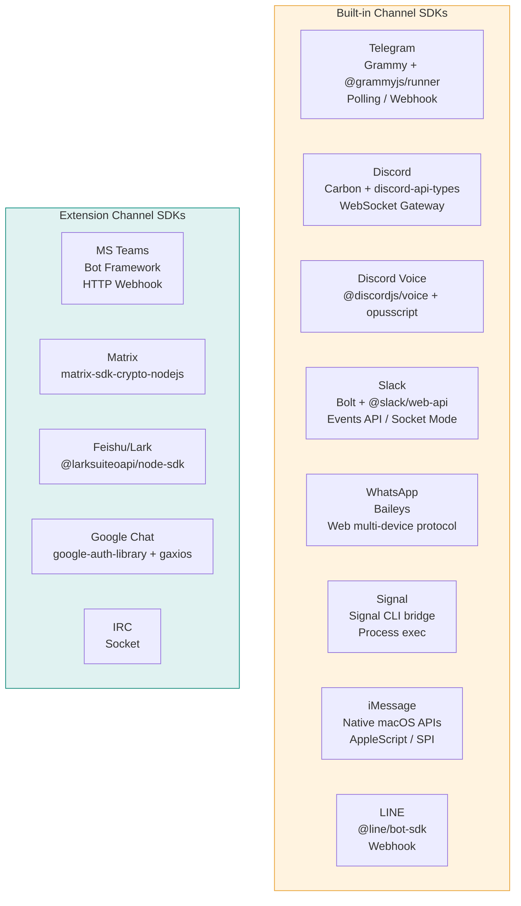

| Channel | SDK / Library | Integration Style |
|---------|---------------|-------------------|
| **Telegram** | Grammy (`grammy`) + `@grammyjs/runner` | Polling/webhook |
| **Discord** | Carbon (`@buape/carbon`) + `discord-api-types` | WebSocket gateway |
| **Discord Voice** | `@discordjs/voice` + `opusscript` | Voice channel audio |
| **Slack** | Bolt (`@slack/bolt`) + `@slack/web-api` | Events API / Socket Mode |
| **WhatsApp** | Baileys (`@whiskeysockets/baileys`) | Web multi-device protocol |
| **Signal** | Signal CLI bridge | Process exec |
| **iMessage** | Native macOS APIs | AppleScript / SPI |
| **LINE** | `@line/bot-sdk` | Webhook |
| **Microsoft Teams** | Bot Framework (extension) | HTTP webhook |
| **Matrix** | `@matrix-org/matrix-sdk-crypto-nodejs` (extension) | SDK |
| **Feishu/Lark** | `@larksuiteoapi/node-sdk` | SDK |
| **Google Chat** | `google-auth-library` + `gaxios` | Service account |
| **IRC** | Extension | Socket |

---

## 6. AI / LLM Integration

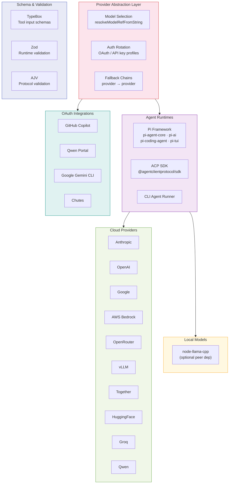

| Component | Technology |
|-----------|-----------|
| **Provider abstraction** | Custom multi-provider layer with model selection, auth rotation, fallback chains |
| **Embedded agent** | Pi framework (`@mariozechner/pi-agent-core`, `pi-ai`, `pi-coding-agent`, `pi-tui`) |
| **Agent Control Protocol** | ACP SDK (`@agentclientprotocol/sdk`) for external agent runtimes |
| **Tool schema** | TypeBox (`@sinclair/typebox`) — no Union types in tool schemas |
| **Schema validation** | Zod (`zod`) + AJV (`ajv`) |
| **Local models** | `node-llama-cpp` (optional peer dep) |
| **Cloud providers** | Anthropic, OpenAI, Google, AWS Bedrock, OpenRouter, vLLM, Together, HuggingFace, Groq, Qwen, etc. |
| **OAuth integrations** | GitHub Copilot, Qwen Portal, Google Gemini CLI, Chutes |

---

## 7. Web UI

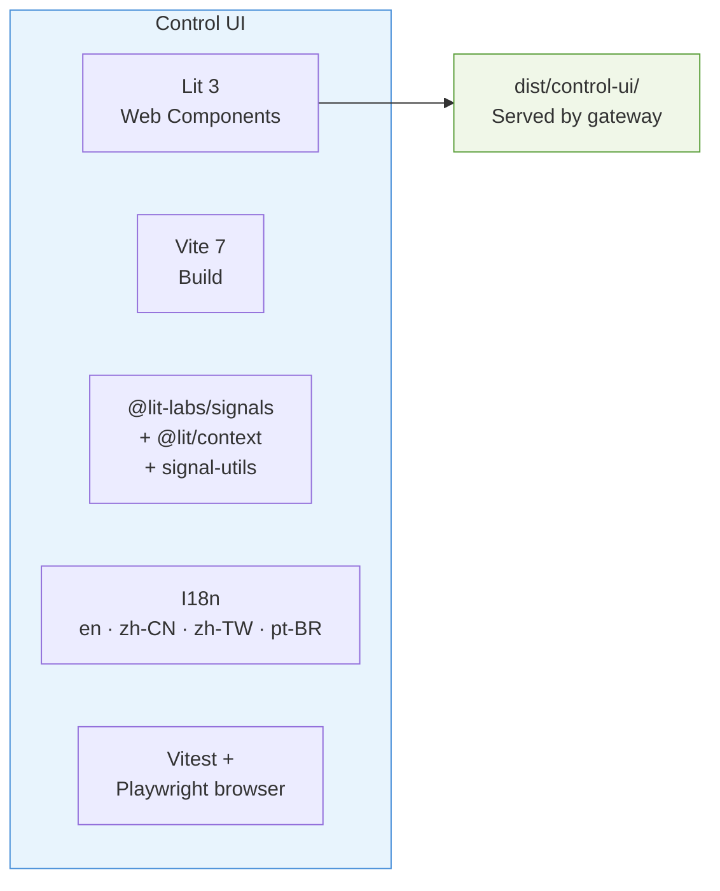

| Component | Technology |
|-----------|-----------|
| **Framework** | Lit 3 (Web Components) |
| **Build** | Vite 7 |
| **State** | `@lit-labs/signals` + `@lit/context` + `signal-utils` |
| **I18n** | Custom i18n (en, zh-CN, zh-TW, pt-BR) |
| **Output** | `dist/control-ui/` — served by gateway at runtime |
| **Tests** | Vitest + `@vitest/browser-playwright` |

---

## 8. Native App Stack

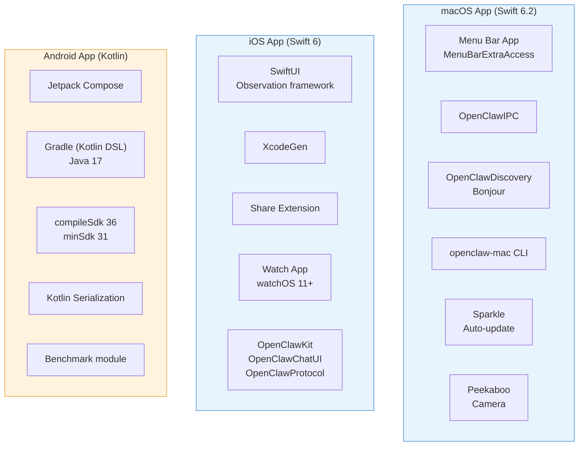

### macOS (Swift 6.2)

| Component | Technology |
|-----------|-----------|
| **App type** | Menu bar app (MenuBarExtraAccess) |
| **IPC** | Custom OpenClawIPC library |
| **Discovery** | Bonjour via `@homebridge/ciao` (Node) + OpenClawDiscovery (Swift) |
| **CLI** | `openclaw-mac` companion CLI (OpenClawMacCLI) |
| **Auto-update** | Sparkle framework |
| **Camera** | Peekaboo framework |
| **Platform** | macOS 15+ |

### iOS (Swift 6)

| Component | Technology |
|-----------|-----------|
| **UI** | SwiftUI (Observation framework preferred) |
| **Project gen** | XcodeGen (`project.yml`) |
| **Targets** | Main app, Share Extension, Watch App, Watch Extension |
| **Shared code** | OpenClawKit, OpenClawChatUI, OpenClawProtocol |
| **Platform** | iOS 18+, watchOS 11+ |

### Android (Kotlin)

| Component | Technology |
|-----------|-----------|
| **UI** | Jetpack Compose |
| **Build** | Gradle (Kotlin DSL), Java 17 |
| **SDK** | compileSdk 36, minSdk 31, targetSdk 36 |
| **Serialization** | Kotlin Serialization |
| **Benchmarking** | `:benchmark` module |

---

## 9. Media & Content Processing

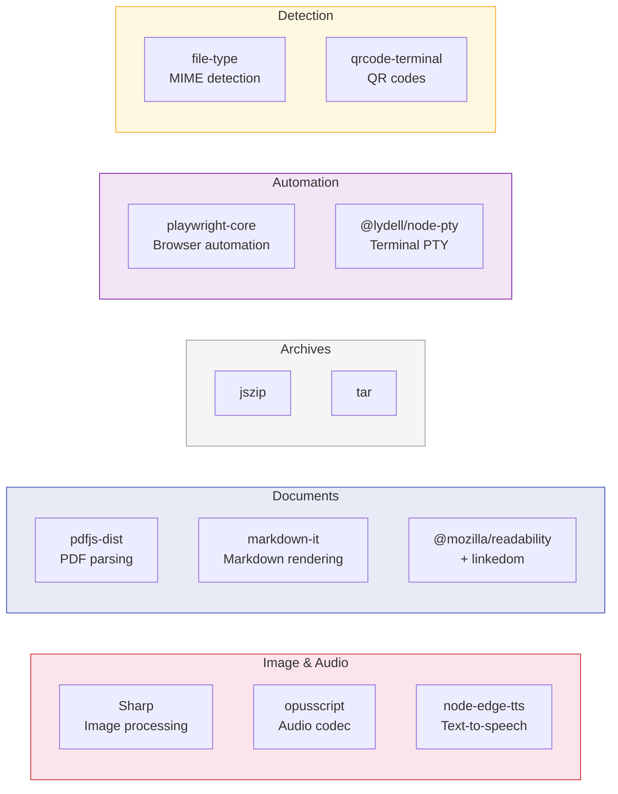

| Capability | Library |
|------------|---------|
| **Image processing** | Sharp (`sharp`) |
| **PDF parsing** | `pdfjs-dist` |
| **HTML readability** | `@mozilla/readability` + `linkedom` |
| **QR codes** | `qrcode-terminal` |
| **MIME detection** | `file-type` |
| **Zip handling** | `jszip` |
| **Archive extraction** | `tar` |
| **Text-to-speech** | `node-edge-tts` |
| **Browser automation** | `playwright-core` |
| **Markdown rendering** | `markdown-it` |
| **Terminal PTY** | `@lydell/node-pty` |

---

## 10. Infrastructure & Ops

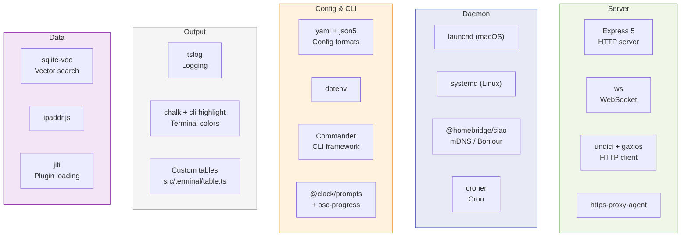

| Component | Technology |
|-----------|-----------|
| **HTTP server** | Express 5 |
| **WebSocket** | `ws` |
| **HTTP client** | `undici` + `gaxios` |
| **Proxy support** | `https-proxy-agent` |
| **Daemon** | launchd (macOS) / systemd (Linux) |
| **Service discovery** | mDNS/Bonjour (`@homebridge/ciao`) |
| **Cron** | `croner` |
| **Config format** | YAML (`yaml`) + JSON5 (`json5`) |
| **Env management** | `dotenv` |
| **CLI framework** | Commander (`commander`) |
| **CLI prompts** | `@clack/prompts` + `osc-progress` |
| **Logging** | `tslog` |
| **Syntax highlighting** | `cli-highlight` + `chalk` |
| **Terminal tables** | Custom (`src/terminal/table.ts`) |
| **Vector search** | `sqlite-vec` |
| **IP parsing** | `ipaddr.js` |
| **Plugin loading** | `jiti` (runtime TypeScript resolution) |

---

## 11. Documentation

| Component | Technology |
|-----------|-----------|
| **Platform** | Mintlify (`docs.openclaw.ai`) |
| **I18n pipeline** | Go-based (`scripts/docs-i18n/main.go`) |
| **Languages** | English (primary), zh-CN, ja-JP |
| **Glossary** | `docs/.i18n/glossary.zh-CN.json` |
| **Translation memory** | `docs/.i18n/zh-CN.tm.jsonl` |
| **Link auditing** | `scripts/docs-link-audit.mjs` |
| **Spellcheck** | `scripts/docs-spellcheck.sh` |

---

## 12. CI / Release

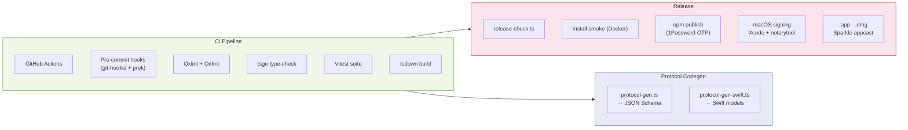

| Component | Technology |
|-----------|-----------|
| **CI** | GitHub Actions (`ci.yml`) |
| **Pre-commit** | Custom git hooks (`git-hooks/`) + `prek install` |
| **Release checks** | `scripts/release-check.ts`, `pnpm release:check` |
| **npm publishing** | Manual with 1Password OTP |
| **macOS signing** | Xcode + notarytool (`APP_STORE_CONNECT_*` env vars) |
| **macOS distribution** | `.app` bundle, `.dmg`, Sparkle appcast |
| **Version scheme** | CalVer: `YYYY.M.D` (stable), `YYYY.M.D-beta.N` (beta) |
| **Changelog** | `CHANGELOG.md` — Changes + Fixes, user-facing only |
| **Install smoke** | `pnpm test:install:smoke` (Docker) |
| **Protocol codegen** | `scripts/protocol-gen.ts` (JSON schema) + `protocol-gen-swift.ts` (Swift models) |
