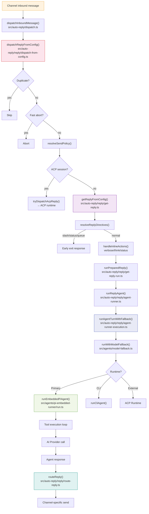
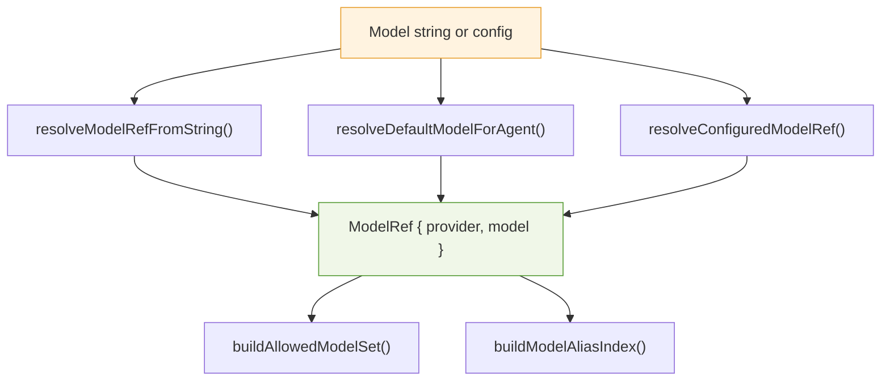
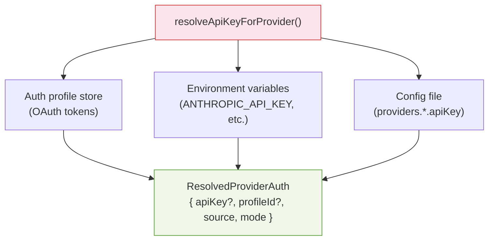

# TypeScript Analysis: Agent Pipeline & AI Providers

## Agent Execution Flow

---

## 1. `src/auto-reply/dispatch.ts` — Inbound Dispatch

| Export | Signature | Purpose |
|--------|-----------|---------|
| `dispatchInboundMessage` | `async (params) => Promise<void>` | Wraps `dispatchReplyFromConfig` with buffered dispatcher |
| `dispatchInboundMessageWithBufferedDispatcher` | `async (params) => Promise<void>` | Dispatch with buffered reply dispatcher |
| `dispatchInboundMessageWithDispatcher` | `async (params) => Promise<void>` | Dispatch with custom dispatcher |

**Invoked by:** All channel monitors after normalizing the inbound message.

---

## 2. `src/auto-reply/reply/dispatch-from-config.ts` — Config-Driven Dispatch

| Export | Signature | Purpose |
|--------|-----------|---------|
| `DispatchFromConfigResult` | `type { queuedFinal, counts }` | Result of dispatch |
| `dispatchReplyFromConfig` | `async (params: { ctx, cfg, dispatcher, replyOptions?, replyResolver? }) => Promise<DispatchFromConfigResult>` | Main config-driven reply dispatcher |

**Responsibilities:**
1. Skip duplicates via `shouldSkipDuplicateInbound`
2. Fast-abort via `tryFastAbortFromMessage`
3. Send policy via `resolveSendPolicy`
4. ACP dispatch via `tryDispatchAcpReply`
5. Otherwise call `getReplyFromConfig` (or custom `replyResolver`)
6. Route final/tool/block replies to dispatcher or `routeReply`

**Invoked by:**
- `src/auto-reply/dispatch.ts`
- `src/plugins/runtime/index.ts` — exposed for plugins
- Extension channels: `extensions/feishu/`, `extensions/matrix/`, `extensions/msteams/`, `extensions/mattermost/`

---

## 3. `src/auto-reply/reply/get-reply.ts` — Core Reply Resolution

| Export | Signature | Purpose |
|--------|-----------|---------|
| `getReplyFromConfig` | `async (ctx, opts?, configOverride?) => Promise<ReplyPayload \| ReplyPayload[] \| undefined>` | Core entry: resolves context, model, session, directives, runs AI |

**Responsibilities:**
1. Merge skill filters, resolve agent workspace, default model
2. Apply media/link understanding
3. Handle session init and reset model override
4. Resolve channel model override
5. `resolveReplyDirectives` → early return for slash/status/queue
6. `handleInlineActions` → status/verbose/think inline commands
7. `runPreparedReply` → full agent run

**Invoked by:**
- `src/auto-reply/reply/dispatch-from-config.ts` (default `replyResolver`)
- `src/infra/heartbeat-runner.ts`
- `src/web/auto-reply/monitor.ts`
- `src/index.ts` (exported for library use)

---

## 4. `src/auto-reply/reply/get-reply-run.ts` — Prepared Reply Runner

| Export | Signature | Purpose |
|--------|-----------|---------|
| `runPreparedReply` | `async (params) => Promise<ReplyPayload \| ReplyPayload[]>` | Runs the full agent turn with queue, followup, exec/slash commands |

**Invoked by:** `src/auto-reply/reply/get-reply.ts`

---

## 5. `src/auto-reply/reply/agent-runner.ts` — Reply Agent Orchestration

| Export | Signature | Purpose |
|--------|-----------|---------|
| `runReplyAgent` | `async (params) => Promise<AgentRunResult>` | Manages followup queue, block reply pipeline, calls `runAgentTurnWithFallback` |

**Invoked by:** `src/auto-reply/reply/get-reply-run.ts`

---

## 6. `src/auto-reply/reply/agent-runner-execution.ts` — Agent Turn with Fallback

| Export | Signature | Purpose |
|--------|-----------|---------|
| `RuntimeFallbackAttempt` | `type { provider, model, error, reason?, status?, code? }` | One fallback attempt record |
| `AgentRunLoopResult` | `type { kind: "success" \| "final"; ... }` | Agent turn outcome |
| `runAgentTurnWithFallback` | `async (params) => Promise<AgentRunLoopResult>` | Runs agent turn with model fallback |

**Responsibilities:**
1. Call `runWithModelFallback` around agent execution
2. Choose between `runEmbeddedPiAgent` and `runCliAgent`
3. Handle compaction failure, role ordering, session corruption
4. Retry transient HTTP errors once
5. Sanitize/strip heartbeat/silent tokens
6. Emit `onBlockReply` / `onToolResult` via delivery handler

**Invoked by:** `src/auto-reply/reply/agent-runner.ts`

---

## 7. `src/auto-reply/reply/route-reply.ts` — Reply Routing

| Export | Signature | Purpose |
|--------|-----------|---------|
| `RouteReplyParams` | type | Input: payload, channel, to, sessionKey, accountId, threadId, cfg |
| `RouteReplyResult` | `type { ok, messageId?, error? }` | Result |
| `routeReply` | `async (params) => Promise<RouteReplyResult>` | Sends reply to channel via outbound delivery |
| `isRoutableChannel` | `(channel?) => boolean` | Checks if channel supports routing |

**Invoked by:**
- `src/auto-reply/reply/dispatch-from-config.ts`
- `src/auto-reply/reply/dispatch-acp-delivery.ts`
- `src/auto-reply/reply/followup-runner.ts`
- `src/auto-reply/reply/get-reply-run.ts` (reset notice)
- `src/auto-reply/reply/commands-core.ts`

---

## 8. `src/auto-reply/reply/followup-runner.ts` — Followup Runner

| Export | Signature | Purpose |
|--------|-----------|---------|
| `createFollowupRunner` | `(params) => FollowupRunner` | Creates runner for followup agent turns |

**Responsibilities:** Runs followup via `runWithModelFallback` + `runEmbeddedPiAgent`, routes results via `routeReply`.

**Invoked by:** `src/auto-reply/reply/agent-runner.ts`

---

## 9. Other Auto-Reply Files

| File | Key Exports | Purpose |
|------|-------------|---------|
| `reply.ts` | Re-exports | Barrel for `getReplyFromConfig`, directives |
| `dispatch-acp.ts` | `tryDispatchAcpReply`, `shouldBypassAcpDispatchForCommand` | ACP session dispatch path |
| `queue.ts` | `enqueueFollowupRun`, `FollowupRun` | Followup queue management |
| `directive-handling.ts` | Default model resolution, think/verbose levels | Pre-agent-run directive resolution |
| `get-reply-directives.ts` | `resolveReplyDirectives` | Early exits for slash/status/queue |

---

## AI Provider Layer

### 10. `src/agents/pi-embedded-runner/run.ts` — Embedded Pi Agent

| Export | Signature | Purpose |
|--------|-----------|---------|
| `runEmbeddedPiAgent` | `async (params: RunEmbeddedPiAgentParams) => Promise<EmbeddedPiRunResult>` | Runs Pi SDK agent with tools, streaming, compaction |

**Invoked by:**
- `src/auto-reply/reply/agent-runner-execution.ts` (via `runAgentTurnWithFallback`)
- `src/auto-reply/reply/followup-runner.ts`
- `src/hooks/llm-slug-generator.ts`
- `extensions/llm-task/src/llm-task-tool.ts`
- `src/cron/isolated-agent/run.ts`

---

### 11. `src/agents/pi-embedded.ts` — Pi Agent Re-exports

| Export | Source | Purpose |
|--------|--------|---------|
| `runEmbeddedPiAgent` | `pi-embedded-runner/run.js` | Main Pi agent runner |
| `abortEmbeddedPiRun` | `pi-embedded-runner/` | Abort active run |
| `compactEmbeddedPiSession` | `pi-embedded-runner/` | Compact session history |
| `isEmbeddedPiRunActive` | `pi-embedded-runner/` | Check if run is active |
| `isEmbeddedPiRunStreaming` | `pi-embedded-runner/` | Check if streaming |
| `queueEmbeddedPiMessage` | `pi-embedded-runner/` | Queue message for active run |
| `resolveEmbeddedSessionLane` | `pi-embedded-runner/` | Lane resolution |
| `waitForEmbeddedPiRunEnd` | `pi-embedded-runner/` | Wait for run completion |

---

### 12. `src/agents/model-selection.ts` — Model Selection

| Export | Signature | Purpose |
|--------|-----------|---------|
| `ModelRef` | `type { provider, model }` | Provider/model reference |
| `modelKey` | `(provider, model) => string` | Normalized key |
| `normalizeProviderId` | `(provider) => string` | Normalize provider ID |
| `isCliProvider` | `(provider, cfg?) => boolean` | Detect CLI-based provider |
| `resolveModelRefFromString` | `(params) => { ref, alias? } \| null` | Parse model from string with aliases |
| `resolveConfiguredModelRef` | `(params) => ModelRef` | Default model from config |
| `resolveDefaultModelForAgent` | `(params) => ModelRef` | Default model for specific agent |
| `buildModelAliasIndex` | `(cfg) => ModelAliasIndex` | Build alias lookup index |
| `buildAllowedModelSet` | `(cfg) => Set<string>` | Build allowlist set |
| `resolveSubagentConfiguredModelSelection` | `(params) => ModelRef` | Subagent model selection |
| `resolveThinkingDefault` | `(params) => ThinkLevel` | Default thinking level |
| `normalizeModelSelection` | `(value) => string \| undefined` | Normalize model selection value |

**Invoked by:** `get-reply.ts`, `agent-runner-utils.ts`, `directive-handling.ts`, `model-fallback.ts`, `pi-embedded-runner/`, gateway methods, CLI commands

---

### 13. `src/agents/model-auth.ts` — Auth Resolution

| Export | Signature | Purpose |
|--------|-----------|---------|
| `ResolvedProviderAuth` | `type { apiKey?, profileId?, source, mode }` | Resolved auth info |
| `resolveApiKeyForProvider` | `async (params) => Promise<ResolvedProviderAuth>` | Main auth resolver: profiles → env → config |
| `resolveEnvApiKey` | `(provider) => EnvApiKeyResult \| null` | Env-based key lookup |
| `resolveModelAuthMode` | `(provider?, cfg?, store?) => ModelAuthMode \| undefined` | Auth mode for provider |
| `getApiKeyForModel` | `async (params) => Promise<ResolvedProviderAuth>` | Auth for a Pi `Model` object |
| `getCustomProviderApiKey` | `(cfg, provider) => string \| undefined` | API key from config |
| `requireApiKey` | `(auth, provider) => string` | Throws if no key |

**Invoked by:**
- `pi-embedded-runner/run.ts` (via `getApiKeyForModel`)
- `src/commands/models/scan.ts`, `doctor-memory-search.ts`
- `src/memory/embeddings*.ts`

---

### 14. `src/agents/model-fallback.ts` — Fallback Chains

| Export | Signature | Purpose |
|--------|-----------|---------|
| `runWithModelFallback` | `async <T>(params) => Promise<ModelFallbackRunResult<T>>` | Tries primary model, then fallbacks |
| `runWithImageModelFallback` | `async <T>(params) => Promise<ModelFallbackRunResult<T>>` | Same for image models |

**Invoked by:**
- `src/auto-reply/reply/agent-runner-execution.ts`
- `src/auto-reply/reply/followup-runner.ts`
- `src/cron/isolated-agent/run.ts`

---

### 15. `src/agents/models-config.providers.ts` — Provider Configuration

| Export | Signature | Purpose |
|--------|-----------|---------|
| `resolveOllamaApiBase` | `(configuredBaseUrl?) => string` | Ollama API base URL |
| `normalizeGoogleModelId` | `(id) => string` | Normalize Google model IDs |
| `normalizeAntigravityModelId` | `(id) => string` | Normalize Antigravity IDs |
| `normalizeProviders` | `(params) => ModelsConfig["providers"]` | Normalize provider config |
| `resolveImplicitProviders` | `async (params) => Promise<ModelsConfig["providers"]>` | Discover providers from auth/env |
| `resolveImplicitCopilotProvider` | `async (params) => Promise<ProviderConfig \| null>` | GitHub Copilot auto-discovery |
| `resolveImplicitBedrockProvider` | `async (params) => Promise<ProviderConfig \| null>` | AWS Bedrock auto-discovery |
| `buildKimiCodingProvider`, `buildXiaomiProvider`, `buildQianfanProvider`, `buildNvidiaProvider`, `buildKilocodeProvider` | functions | Specific provider builders |

**Invoked by:** `src/agents/models-config.ts`, model discovery and config loading paths

---

## ACP Runtime Layer

### 16. `src/acp/runtime/registry.ts` — ACP Backend Registry

| Export | Signature | Purpose |
|--------|-----------|---------|
| `registerAcpRuntimeBackend` | `(backend) => void` | Register an ACP runtime backend |
| `unregisterAcpRuntimeBackend` | `(id) => void` | Unregister backend |
| `getAcpRuntimeBackend` | `() => AcpRuntimeBackend \| null` | Get current backend |
| `requireAcpRuntimeBackend` | `() => AcpRuntimeBackend` | Get or throw |

**Invoked by:** `extensions/acpx/` (registers backend), `src/auto-reply/reply/dispatch-acp.ts`

---

### 17. `src/acp/runtime/types.ts` — ACP Contracts

| Export | Purpose |
|--------|---------|
| `AcpRuntime` | Runtime interface |
| `AcpRuntimeHandle` | Handle for an active ACP session |
| `AcpRuntimeEnsureInput` | Input for ensuring a session |
| `AcpRuntimeTurnInput` | Input for a turn |
| `AcpRuntimeEvent` | Event from ACP runtime |
| `AcpRuntimeCapabilities` | Backend capabilities |

**Invoked by:** `acp/` modules, `auto-reply/reply/dispatch-acp.ts`, `plugin-sdk/`

---

### 18. `src/acp/runtime/errors.ts` — ACP Error Handling

| Export | Signature | Purpose |
|--------|-----------|---------|
| `AcpRuntimeError` | class | ACP-specific error |
| `ACP_ERROR_CODES` | const | Error code constants |
| `isAcpRuntimeError` | type guard | Check error type |
| `toAcpRuntimeError` | `(err) => AcpRuntimeError` | Convert to ACP error |
| `withAcpRuntimeErrorBoundary` | `async (fn) => Promise<T>` | Error boundary wrapper |

**Invoked by:** ACP runtime modules, dispatch path
