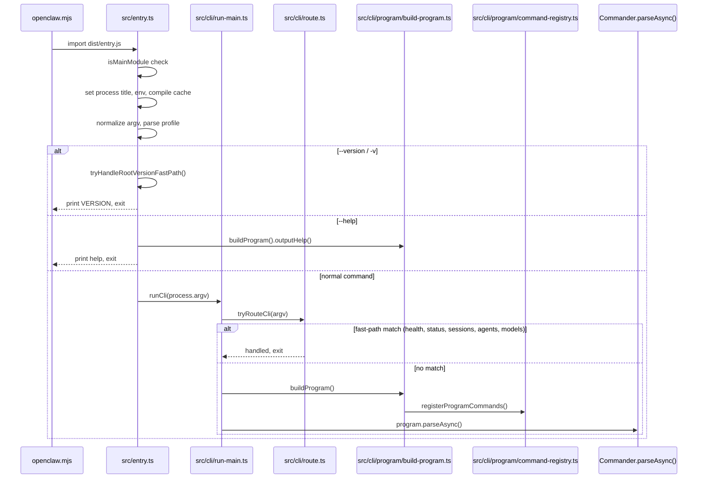
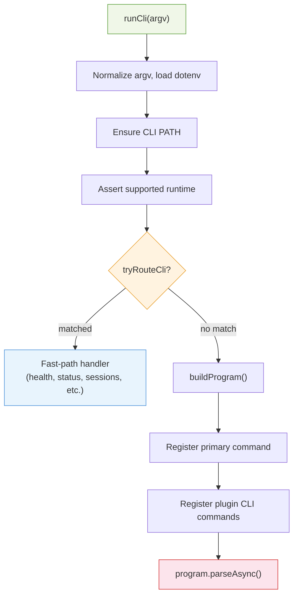

# TypeScript Analysis: Entry Points & CLI Layer

## Invocation Flow

---

## 1. `src/entry.ts` — CLI Entry Point

**Role:** Top-level script invoked by `openclaw.mjs` (the npm bin target). Not a library — no exports.

| Internal Function | Signature | Purpose |
|-------------------|-----------|---------|
| `shouldForceReadOnlyAuthStore` | `(argv: string[]) => boolean` | Forces read-only auth store for `secrets audit` |
| `hasExperimentalWarningSuppressed` | `() => boolean` | Checks if Node ExperimentalWarning is suppressed |
| `ensureExperimentalWarningSuppressed` | `() => boolean` | Respawns process with `--disable-warning=ExperimentalWarning` if needed |
| `tryHandleRootVersionFastPath` | `(argv: string[]) => boolean` | Prints version and exits for `-v`, `-V`, `--version` |
| `tryHandleRootHelpFastPath` | `(argv: string[]) => boolean` | Shows help via `buildProgram().outputHelp()` for root `--help` |

**Invocation:** `openclaw.mjs` → Node loader → `dist/entry.js`

**Calls into:**
- `src/cli/argv.js` — `isRootHelpInvocation`, `isRootVersionInvocation`
- `src/cli/profile.js` — `applyCliProfileEnv`, `parseCliProfileArgs`
- `src/cli/respawn-policy.js` — `shouldSkipRespawnForArgv`
- `src/cli/windows-argv.js` — `normalizeWindowsArgv`
- `src/cli/run-main.js` — `runCli`
- `src/infra/is-main.js` — `isMainModule`
- `src/infra/warning-filter.js` — `installProcessWarningFilter`
- `src/process/child-process-bridge.js` — `attachChildProcessBridge`

---

## 2. `src/index.ts` — Main Library Exports

**Role:** Public API surface (`package.json` `main: dist/index.js`). Also acts as CLI entry when used as main module.

| Export | Type | Purpose |
|--------|------|---------|
| `assertWebChannel` | function | Asserts Web channel context |
| `applyTemplate` | function | Template substitution for auto-reply |
| `createDefaultDeps` | function | Creates default CLI deps (channel send functions) |
| `deriveSessionKey` | function | Derives session key from config |
| `describePortOwner` | function | Describes process owning a port |
| `ensureBinary` | function | Ensures binary exists |
| `ensurePortAvailable` | function | Ensures port is free |
| `getReplyFromConfig` | function | Gets AI reply from config |
| `handlePortError` | function | Handles port-in-use errors |
| `loadConfig` | function | Loads OpenClaw config |
| `loadSessionStore` | function | Loads session store |
| `monitorWebChannel` | function | Monitors WhatsApp Web channel |
| `normalizeE164` | function | Normalizes E.164 phone numbers |
| `PortInUseError` | class | Port-in-use error |
| `promptYesNo` | function | Yes/no CLI prompt |
| `resolveSessionKey` | function | Resolves session key |
| `resolveStorePath` | function | Resolves store path |
| `runCommandWithTimeout` | function | Runs command with timeout |
| `runExec` | function | Runs exec helper |
| `saveSessionStore` | function | Saves session store |
| `toWhatsappJid` | function | Converts to WhatsApp JID |
| `waitForever` | function | Never-resolving promise |

**Invoked by:**
- External consumers via `import "openclaw"`
- When run as main module: calls `buildProgram().parseAsync(process.argv)`

---

## 3. `src/runtime.ts` — Runtime Environment

**Role:** Abstraction for log/error/exit so tests can intercept.

| Export | Signature | Purpose |
|--------|-----------|---------|
| `RuntimeEnv` | `type { log, error, exit }` | Runtime IO abstraction |
| `defaultRuntime` | `const RuntimeEnv` | Real runtime using `console` + `process.exit` |
| `createNonExitingRuntime` | `() => RuntimeEnv` | Runtime where `exit()` throws instead of exiting |

**Invoked by:** 60+ files across CLI commands, gateway, agents, infra — anywhere that needs structured output or testable exit behavior.

---

## 4. `src/version.ts` — Version Info

| Export | Signature | Purpose |
|--------|-----------|---------|
| `VERSION` | `const string` | Current binary version |
| `readVersionFromPackageJsonForModuleUrl` | `(moduleUrl: string) => string \| null` | Reads version from package.json |
| `readVersionFromBuildInfoForModuleUrl` | `(moduleUrl: string) => string \| null` | Reads version from build-info.json |
| `resolveVersionFromModuleUrl` | `(moduleUrl: string) => string \| null` | Tries package.json then build-info |
| `resolveBinaryVersion` | `(params) => string` | Version with injected/bundled/fallback |
| `resolveRuntimeServiceVersion` | `(env?, fallback?) => string` | Version from env vars |

**Invoked by:** `src/entry.ts` (version fast path), `src/commands/status.update.ts`, `src/cli/program/context.ts`, `src/cli/program/help.ts`

---

## 5. `src/cli/program/build-program.ts` — Commander Program Builder

| Export | Signature | Purpose |
|--------|-----------|---------|
| `buildProgram` | `() => Command` | Builds root Commander program with help, hooks, and all commands |

**Flow:**
1. `new Command()` → `createProgramContext()` → `setProgramContext()`
2. `configureProgramHelp()` — custom help formatting
3. `registerPreActionHooks()` — banner, verbose, config guard, plugin load
4. `registerProgramCommands()` — all core + subcli commands

**Invoked by:**
- `src/entry.ts` — help fast path
- `src/cli/run-main.ts` — main CLI path
- `src/index.ts` — when used as main module

---

## 6. `src/cli/program/command-registry.ts` — Command Registration

| Export | Signature | Purpose |
|--------|-----------|---------|
| `getCoreCliCommandNames` | `() => string[]` | All core top-level command names |
| `getCoreCliCommandsWithSubcommands` | `() => string[]` | Commands that have subcommands |
| `registerCoreCliByName` | `(program, ctx, name, argv?) => Promise<boolean>` | Registers one core command by name |
| `registerProgramCommands` | `(program, ctx, argv?) => void` | Registers all core + subcli commands |

**Registered commands:** `setup`, `onboard`, `configure`, `config`, `doctor`, `dashboard`, `reset`, `uninstall`, `message`, `memory`, `agent`, `agents`, `status`, `health`, `sessions`, `browser`, plus subcli groups (gateway, channels, models, pairing, nodes, cron, system, acp, devices, tui, update, login, secrets, sandbox, tools).

**Invoked by:**
- `src/cli/program/build-program.ts` — `registerProgramCommands()`
- `src/cli/run-main.ts` — `registerCoreCliByName()` for primary command
- `src/cli/completion-cli.ts` — shell completion

---

## 7. `src/cli/run-main.ts` — CLI Runner

| Export | Signature | Purpose |
|--------|-----------|---------|
| `runCli` | `(argv?: string[]) => Promise<void>` | Main CLI runner |
| `rewriteUpdateFlagArgv` | `(argv: string[]) => string[]` | Replaces `--update` with subcommand `update` |
| `shouldRegisterPrimarySubcommand` | `(argv: string[]) => boolean` | Whether to register only the primary command |
| `shouldSkipPluginCommandRegistration` | `(params) => boolean` | Whether to skip plugin CLI registration |
| `shouldEnsureCliPath` | `(argv: string[]) => boolean` | Whether to add openclaw to PATH |

**`runCli` flow:**

**Invoked by:** `src/entry.ts` — the sole caller

---

## 8. `src/cli/deps.ts` — Dependency Injection

| Export | Signature | Purpose |
|--------|-----------|---------|
| `CliDeps` | type | Channel send function types |
| `createDefaultDeps` | `() => CliDeps` | Lazy-loaded channel send implementations |
| `createOutboundSendDeps` | `(deps: CliDeps) => OutboundSendDeps` | Maps CliDeps to OutboundSendDeps |

**Invoked by:**
- `createDefaultDeps`: `src/index.ts`, `src/commands/agent.ts`, `src/cli/program/message/helpers.ts`, `src/gateway/openai-http.ts`, `src/hooks/bundled/boot-md/handler.ts`
- `createOutboundSendDeps`: `src/commands/agent/delivery.ts`, `src/commands/message.ts`, `src/cron/isolated-agent/delivery-dispatch.ts`, `src/gateway/server-methods/send.ts`, `src/gateway/server-cron.ts`

---

## 9. `src/cli/progress.ts` — Progress Indicators

| Export | Signature | Purpose |
|--------|-----------|---------|
| `ProgressReporter` | type | `{ setLabel, setPercent, tick, done }` |
| `createCliProgress` | `(options) => ProgressReporter` | Spinner/line/log or osc-progress |
| `withProgress` | `<T>(options, work) => Promise<T>` | Wraps async work with progress |
| `withProgressTotals` | `<T>(options, work) => Promise<T>` | Progress with totals callback |

**Invoked by:** `src/commands/gateway-status.ts`, `channels/list.ts`, `status.scan.ts`, `channels/status.ts`, `health.ts`, `configure.daemon.ts`, `message.ts`, `src/wizard/clack-prompter.ts`, `src/cli/daemon-cli/probe.ts`, `devices-cli.ts`, `gateway-cli/call.ts`, `nodes-cli/rpc.ts`

---

## 10. `src/cli/route.ts` — Fast-Path Routing

| Export | Signature | Purpose |
|--------|-----------|---------|
| `tryRouteCli` | `(argv, program) => Promise<boolean>` | Handles fast-path commands without full program parse |

**Fast-path commands:** `health`, `status`, `sessions list`, `agents list`, `models list`, `channels list`, `channels status`

**Invoked by:** `src/cli/run-main.ts` — before `buildProgram()`

---

## 11. `src/cli/program/` — Supporting CLI Modules

| File | Key Exports | Invoked By |
|------|-------------|------------|
| `context.ts` | `ProgramContext`, `createProgramContext` | `build-program.ts` |
| `program-context.ts` | `setProgramContext`, `getProgramContext` | `build-program.ts`, commands |
| `preaction.ts` | `registerPreActionHooks` | `build-program.ts` |
| `help.ts` | `configureProgramHelp` | `build-program.ts` |
| `routes.ts` | `RouteSpec`, `findRoutedCommand` | `route.ts` |

---

## 12. `src/commands/` — Command Implementations

| File | Key Exports | Purpose | Invoked By |
|------|-------------|---------|------------|
| `setup.ts` | `setupCommand` | Initialize workspace and config | `register.setup.js` |
| `onboard.ts` | `onboardCommand` | Onboarding entry point | `register.onboard.js` |
| `onboard-interactive.ts` | Interactive wizard | Full wizard flow | `onboard.ts` |
| `doctor.ts` | Doctor logic | Health checks and fixes | `register.maintenance.js` |
| `agent.ts` | Agent command | Agent via gateway or direct | `register.agent.js` |
| `agents.ts` | `agentsListCommand` | Agent management CRUD | `register.agent.js` |
| `status-all.ts` | Status scan | `status --all` deep scan | `register.status-health-sessions.js` |
| `sessions.ts` | `sessionsCommand` | Session listing | `register.status-health-sessions.js` |
| `health.ts` | `healthCommand` | Gateway health check | `register.status-health-sessions.js` |
| `message.ts` | Message send | `message send` / `message read` | `register.message.js` |
| `dashboard.ts` | Dashboard link | Open control UI | `register.maintenance.js` |
| `uninstall.ts` | Uninstall flow | Remove gateway + data | `register.maintenance.js` |
| `reset.ts` | Reset flow | Reset config/state | `register.maintenance.js` |

---

## 13. `src/wizard/` — Onboarding Wizard

| File | Key Exports | Purpose | Invoked By |
|------|-------------|---------|------------|
| `onboarding.ts` | `runOnboardingWizard` | Main wizard flow (risk, config, auth, channels, skills) | `onboard-interactive.ts`, `server.impl.ts` (wizard runner) |
| `clack-prompter.ts` | `createClackPrompter` | @clack/prompts-based interactive prompter | `onboard-interactive.ts`, `configure.wizard.ts`, `agents.commands.add.ts`, `channels/add.ts`, `models/auth.ts` |
| `prompts.ts` | `WizardPrompter`, `WizardSelectOption`, `WizardCancelledError` | Wizard type contracts | `onboarding.ts`, prompter implementations |
| `onboarding.types.ts` | `WizardFlow`, `GatewayWizardSettings` | Config types | `onboarding.ts` |
| `onboarding.gateway-config.ts` | Gateway config setup | Gateway setup in wizard | `onboarding.ts` |
| `onboarding.finalize.ts` | Finalization | Post-onboarding steps | `onboarding.ts` |
| `session.ts` | Session utilities | Session wiring | `onboarding.ts` |
