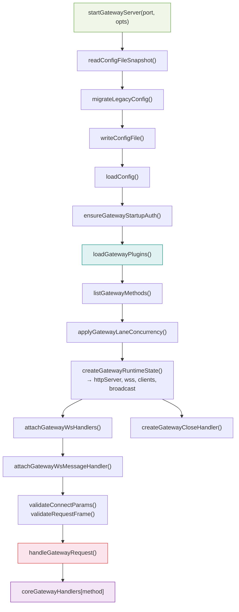
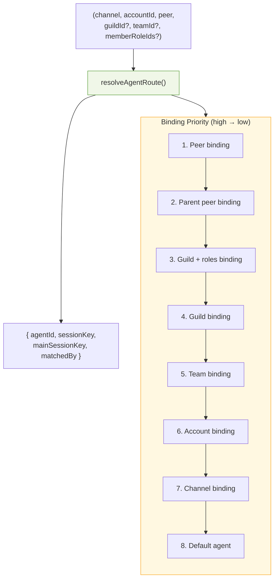

# TypeScript Analysis: Gateway Server & Routing Layer

## Gateway Startup Flow

---

## 1. `src/gateway/server.impl.ts` — Gateway Server Startup

| Export | Signature | Purpose |
|--------|-----------|---------|
| `GatewayServer` | `type { close: (opts?) => Promise<void> }` | Handle for shutting down the gateway |
| `GatewayServerOptions` | `type { bind?, host?, controlUiEnabled?, openAiChatCompletionsEnabled?, openResponsesEnabled?, auth?, tailscale?, allowCanvasHostInTests?, wizardRunner? }` | Startup options |
| `startGatewayServer` | `async (port?, opts?) => Promise<GatewayServer>` | Main entry: config, plugins, TLS, HTTP/WS, channels, cron, discovery |

**Internal helpers:**
- `createGatewayAuthRateLimiters` — builds auth + browser rate limiters
- `activateRuntimeSecrets` — prepares and activates secrets snapshot
- `emitSecretsStateEvent` — emits `SECRETS_RELOADER_*` events

**Invoked by:**
- `src/cli/gateway-cli/run.ts` — `openclaw gateway run` command
- `src/gateway/server.ts` — re-exports
- Test files: `gateway.test.ts`, `server.auth.test.ts`, `server.models-voicewake-misc.test.ts`, `server.config-apply.test.ts`, `openai-http.test.ts`, `server.hooks.test.ts`, `server.reload.test.ts`, `server.sessions-send.test.ts`

---

## 2. `src/gateway/server.ts` — Re-export Barrel

Re-exports from `server.impl.js`:
- `GatewayServer`, `GatewayServerOptions`, `startGatewayServer`, `__resetModelCatalogCacheForTest`
- `truncateCloseReason` from `./server/close-reason.js`

**Invoked by:** All gateway startup and test entrypoints

---

## 3. `src/gateway/server-runtime-state.ts`

| Export | Signature | Purpose |
|--------|-----------|---------|
| `createGatewayRuntimeState` | `async (params) => Promise<{ canvasHost, httpServer, httpServers, wss, clients, broadcast, ... }>` | Creates HTTP/WS servers, broadcaster, chat run state |

**Invoked by:** `src/gateway/server.impl.ts`

---

## 4. `src/gateway/server-ws-runtime.ts`

| Export | Signature | Purpose |
|--------|-----------|---------|
| `attachGatewayWsHandlers` | `(params) => void` | Attaches WebSocket connection/message handling |

**Invoked by:** `src/gateway/server.impl.ts`

---

## 5. `src/gateway/server-close.ts`

| Export | Signature | Purpose |
|--------|-----------|---------|
| `createGatewayCloseHandler` | `(params) => (opts?) => Promise<void>` | Returns the gateway shutdown function |

**Invoked by:** `src/gateway/server.impl.ts`

---

## 6. `src/gateway/server-plugins.ts` — Plugin Loading

| Export | Signature | Purpose |
|--------|-----------|---------|
| `loadGatewayPlugins` | `(params: { cfg, workspaceDir, log, coreGatewayHandlers, baseMethods }) => { pluginRegistry, gatewayMethods }` | Loads plugins, returns registry + combined method list |

**Invoked by:** `src/gateway/server.impl.ts`, `server-plugins.test.ts`

---

## 7. `src/gateway/server-lanes.ts` — Lane Concurrency

| Export | Signature | Purpose |
|--------|-----------|---------|
| `applyGatewayLaneConcurrency` | `(cfg) => void` | Sets lane concurrency from config (cron, main, subagent) |

**Invoked by:** `src/gateway/server.impl.ts`

---

## 8. `src/gateway/server-methods.ts` — RPC Method Dispatch

| Export | Signature | Purpose |
|--------|-----------|---------|
| `coreGatewayHandlers` | `GatewayRequestHandlers` | Map of method name → handler function |
| `handleGatewayRequest` | `async (opts) => Promise<void>` | Auth + rate limit checks, then dispatches to handler |

**Invoked by:**
- `handleGatewayRequest`: `src/gateway/server/ws-connection/message-handler.ts`
- `coreGatewayHandlers`: `src/gateway/server.impl.ts` (passed to `loadGatewayPlugins`)

---

## 9. `src/gateway/server-methods/types.ts` — Handler Types

| Export | Type | Purpose |
|--------|------|---------|
| `GatewayClient` | object | Client connection info (connect params, connId, clientIp, capabilities) |
| `RespondFn` | `(ok, payload?, error?, meta?) => void` | Response callback |
| `GatewayRequestContext` | object | Shared context with deps, cron, broadcast, lane state |
| `GatewayRequestOptions` | object | Handler input: req, client, respond, context |
| `GatewayRequestHandler` | `(opts) => Promise<void> \| void` | Individual method handler |
| `GatewayRequestHandlers` | `Record<string, GatewayRequestHandler>` | Method → handler map |

**Invoked by:** `server.impl.ts`, `server-ws-runtime.ts`, `control-plane-rate-limit.ts`, `control-plane-audit.ts`, `plugins/registry.ts`, `plugins/loader.ts`, `plugin-sdk/index.ts`

---

## 10. `src/gateway/server-methods/` — Individual RPC Handlers

```mermaid
graph TB
    Dispatch["handleGatewayRequest()"]

    subgraph CoreMethods["Core Method Handlers"]
        direction LR
        agent["agent.ts"]
        agents["agents.ts"]
        browser["browser.ts"]
        channels["channels.ts"]
        chat["chat.ts"]
        config["config.ts"]
        connect["connect.ts"]
        cron["cron.ts"]
        devices["devices.ts"]
        doctor["doctor.ts"]
        exec["exec-approval.ts"]
        health["health.ts"]
        logs["logs.ts"]
        models["models.ts"]
        nodes["nodes.ts"]
        push["push.ts"]
        send["send.ts"]
        sessions["sessions.ts"]
        skills["skills.ts"]
        system["system.ts"]
        talk["talk.ts"]
        tools["tools-catalog.ts"]
        tts["tts.ts"]
        update["update.ts"]
        usage["usage.ts"]
        voicewake["voicewake.ts"]
        web["web.ts"]
        wizard["wizard.ts"]
    end

    Dispatch --> CoreMethods

    style Dispatch fill:#fce4ec,stroke:#d32f2f
    style CoreMethods fill:#f0f7e8,stroke:#5a9e3a
```

Each handler file exports a method handler registered in `coreGatewayHandlers`.

---

## 11. `src/gateway/protocol/index.ts` — Protocol Validation

| Export Category | Examples | Purpose |
|-----------------|----------|---------|
| **Frame validators** | `validateConnectParams`, `validateRequestFrame`, `validateResponseFrame`, `validateEventFrame` | AJV-compiled frame validation |
| **Param validators** | `validateSendParams`, `validateAgentParams`, `validateConfigSetParams`, `validateWizardStartParams`, ... | Per-method parameter validation |
| **Helpers** | `formatValidationErrors(errors)` | Format AJV errors for logs/responses |

**Invoked by:**
- `validateConnectParams`, `validateRequestFrame`: `src/gateway/server/ws-connection/message-handler.ts`
- `formatValidationErrors`: all `server-methods/*.ts` modules
- Validators: corresponding `server-methods/*.ts` handler that needs param validation

---

## 12. `src/gateway/protocol/schema/frames.ts` — Frame Schemas

| Export | Purpose |
|--------|---------|
| `ConnectParamsSchema` | WebSocket connect params (client, caps, role, scopes, device, auth) |
| `RequestFrameSchema` | `{ type: "req", id, method, params }` |
| `ResponseFrameSchema` | `{ type: "res", id, ok, payload?, error? }` |
| `EventFrameSchema` | `{ type: "event", event, payload?, seq?, stateVersion? }` |
| `GatewayFrameSchema` | Union of req/res/event with discriminator `type` |
| `HelloOkSchema` | Post-connect hello response |
| `TickEventSchema`, `ShutdownEventSchema` | Lifecycle events |

**Invoked by:** `src/gateway/protocol/index.ts` (compiled into AJV validators)

---

## 13. `src/gateway/server-methods-list.ts`

| Export | Signature | Purpose |
|--------|-----------|---------|
| `listGatewayMethods` | `() => string[]` | All gateway method names (base + channel) |
| `GATEWAY_EVENTS` | `string[]` | All gateway event names |

**Invoked by:** `src/gateway/server.impl.ts`

---

## 14. `src/gateway/server-session-key.ts`

| Export | Signature | Purpose |
|--------|-----------|---------|
| `resolveSessionKeyForRun` | `(runId: string) => string \| undefined` | Resolves session key for an active agent run |

**Invoked by:** `src/gateway/server.impl.ts`, `src/gateway/server-chat.ts`

---

## Routing Layer

### 15. `src/routing/resolve-route.ts` — Route Resolution

| Export | Signature | Purpose |
|--------|-----------|---------|
| `resolveAgentRoute` | `(input: ResolveAgentRouteInput) => ResolvedAgentRoute` | Picks agent + session key from bindings |
| `buildAgentSessionKey` | `(params) => string` | Builds session key from agent + channel + peer |
| `ResolveAgentRouteInput` | type | Input for route resolution |
| `ResolvedAgentRoute` | type | Output: agentId, sessionKey, matchedBy |

**Invoked by:** Every channel's inbound handler:
- `src/telegram/bot-handlers.ts`, `bot-native-commands.ts`, `bot-message-context.ts`
- `src/discord/monitor/native-command.ts`, `listeners.ts`, `message-handler.preflight.ts`, `agent-components.ts`, `voice/manager.ts`
- `src/slack/monitor/message-handler/prepare.ts`, `slash.ts`
- `src/signal/monitor/event-handler.ts`
- `src/imessage/monitor/inbound-processing.ts`
- `src/web/auto-reply/monitor.ts`, `monitor/on-message.ts`
- `src/line/bot-message-context.ts`
- `src/plugins/runtime/index.ts`

---

### 16. `src/routing/session-key.ts` — Session Key Helpers

| Export | Signature | Purpose |
|--------|-----------|---------|
| `DEFAULT_AGENT_ID` | `"main"` | Default agent |
| `DEFAULT_MAIN_KEY` | `"main"` | Default main key |
| `DEFAULT_ACCOUNT_ID` | `"default"` | Default account |
| `normalizeAgentId` | `(value) => string` | Path-safe, shell-friendly agent ID |
| `normalizeAccountId` | `(value) => string` | Normalized account ID |
| `buildAgentMainSessionKey` | `(params) => string` | Builds `agent:{agentId}:{mainKey}` |
| `buildAgentPeerSessionKey` | `(params) => string` | Builds per-peer session key |
| `buildGroupHistoryKey` | `(params) => string` | Builds group history key |
| `resolveThreadSessionKeys` | `(params) => { sessionKey, parentSessionKey? }` | Thread session keys |
| `toAgentStoreSessionKey` | `(params) => string` | Builds store key from request key |
| `toAgentRequestSessionKey` | `(storeKey) => string \| undefined` | Maps store key to request key |
| `resolveAgentIdFromSessionKey` | `(sessionKey) => string` | Extracts agent ID |
| `classifySessionKeyShape` | `(sessionKey) => SessionKeyShape` | Classifies key format |

**Invoked by:** Used across `agents/`, `commands/`, `config/`, `cron/`, `gateway/`, `auto-reply/`, `acp/`, `routing/` — core plumbing for session identity.

---

### 17. `src/routing/bindings.ts` — Binding Helpers

| Export | Signature | Purpose |
|--------|-----------|---------|
| `listBindings` | `(cfg) => AgentBinding[]` | All bindings from config |
| `listBoundAccountIds` | `(cfg, channelId) => string[]` | Account IDs bound to channel |
| `resolveDefaultAgentBoundAccountId` | `(cfg, channelId) => string \| null` | Default agent's bound account |
| `buildChannelAccountBindings` | `(cfg) => Map<channelId, Map<agentId, accountIds[]>>` | Full binding map |
| `resolvePreferredAccountId` | `(params) => string` | Picks preferred account |

**Invoked by:** `src/routing/resolve-route.ts`, `src/telegram/accounts.ts`

---

## Configuration Layer

### 18. `src/config/io.ts` — Config I/O

| Export | Signature | Purpose |
|--------|-----------|---------|
| `loadConfig` | `(path?) => OpenClawConfig` | Loads config with caching, env substitution, validation |
| `readConfigFileSnapshot` | `() => ConfigSnapshot` | Reads config file, returns snapshot + validation |
| `readConfigFileSnapshotForWrite` | `() => ConfigSnapshot` | Prepares snapshot for writes |
| `writeConfigFile` | `(snapshot, changes) => void` | Writes config to disk |
| `clearConfigCache` | `() => void` | Clears runtime cache |
| `getRuntimeConfigSnapshot` | `() => ConfigSnapshot` | Runtime snapshot accessor |
| `setRuntimeConfigSnapshot` | `(snapshot) => void` | Set runtime snapshot |
| `parseConfigJson5` | `(str) => object` | Parse JSON5 config |

**Invoked by:** Gateway startup, channel managers, routing, sessions, CLI commands — anywhere config is needed.

---

### 19. `src/config/paths.ts` — Config Paths

| Export | Signature | Purpose |
|--------|-----------|---------|
| `resolveStateDir` | `() => string` | Resolves state directory |
| `resolveConfigPath` | `() => string` | Resolves config file path |
| `resolveDefaultConfigCandidates` | `() => string[]` | Config path candidates |
| `isNixMode` | `() => boolean` | Nix mode detection |

**Invoked by:** `src/config/io.ts`, gateway startup, daemon management
