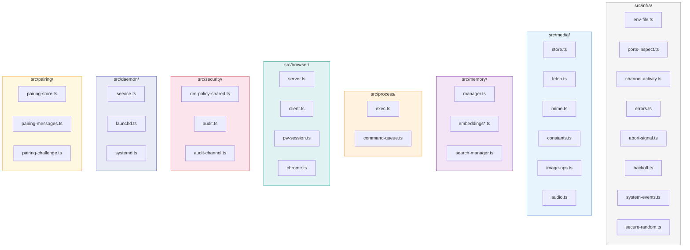
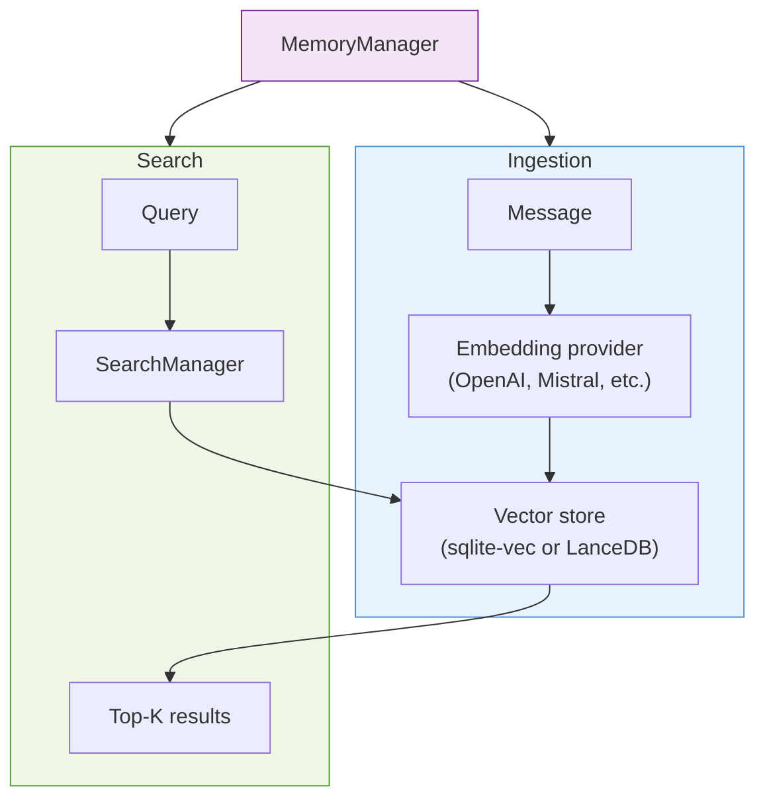
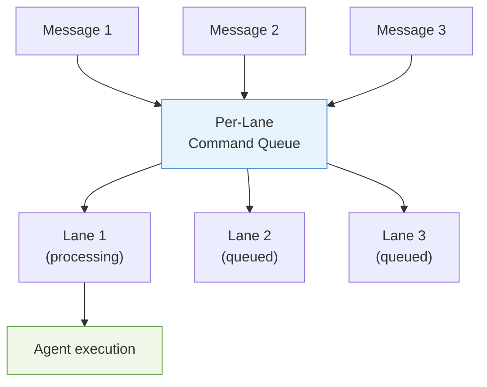

# TypeScript Analysis: Infrastructure, Media & Utilities

## Infrastructure Module Map

---

## 1. `src/infra/` — Core Infrastructure

### `src/infra/env-file.ts`

| Export | Signature | Purpose |
|--------|-----------|---------|
| `upsertSharedEnvVar` | `(key, value, envPath?) => void` | Add/update env variable in `.env` file |

**Invoked by:** Config setup, onboarding, channel auth flows

---

### `src/infra/ports-inspect.ts`

| Export | Signature | Purpose |
|--------|-----------|---------|
| `inspectPorts` | `(ports?) => Promise<PortUsage[]>` | List port listeners via lsof/ps |
| `PortUsage` | type | Port usage info (port, pid, process) |

**Invoked by:** `src/commands/doctor.ts`, `src/infra/ports.ts`, gateway startup

---

### `src/infra/channel-activity.ts`

| Export | Signature | Purpose |
|--------|-----------|---------|
| `recordChannelActivity` | `(channel, event) => void` | Track channel activity timestamp |
| `getChannelActivity` | `(channel) => ActivityRecord` | Read activity record |

**Invoked by:** Channel monitors, status commands

---

### `src/infra/errors.ts`

| Export | Signature | Purpose |
|--------|-----------|---------|
| `formatErrorMessage` | `(err) => string` | Format error for display |
| `formatUncaughtError` | `(err) => string` | Format uncaught errors |
| `isAbortError` | `(err) => boolean` | Check if abort error |

**Invoked by:** Error handlers across CLI, gateway, agents

---

### `src/infra/abort-signal.ts`

| Export | Signature | Purpose |
|--------|-----------|---------|
| `waitForAbortSignal` | `(signal) => Promise<void>` | Wait for abort signal |

**Invoked by:** Long-running operations (gateway, monitors, agent runs)

---

### `src/infra/backoff.ts`

| Export | Signature | Purpose |
|--------|-----------|---------|
| `computeBackoff` | `(attempt, opts?) => number` | Calculate exponential backoff delay |
| `sleepWithAbort` | `(ms, signal?) => Promise<void>` | Sleep with abort support |

**Invoked by:** Retry loops in channel monitors, provider calls, webhook delivery

---

### `src/infra/system-events.ts`

| Export | Signature | Purpose |
|--------|-----------|---------|
| `enqueueSystemEvent` | `(event) => void` | Queue system event for processing |

**Invoked by:** Gateway lifecycle events, channel state changes

---

### `src/infra/secure-random.ts`

| Export | Signature | Purpose |
|--------|-----------|---------|
| `generateSecureUuid` | `() => string` | Crypto-random UUID |

**Invoked by:** Session creation, pairing, request IDs

---

## 2. `src/media/` — Media Pipeline

### `src/media/store.ts`

| Export | Signature | Purpose |
|--------|-----------|---------|
| `saveMediaBuffer` | `(buffer, opts?) => Promise<MediaStoreResult>` | Save media with SSRF-safe fetch, hash-keyed storage |
| `extractOriginalFilename` | `(url) => string \| null` | Extract filename from URL |
| `MEDIA_MAX_BYTES` | `const number` | Max media size |

**Invoked by:** `src/plugins/runtime/index.ts`, `src/web/media.js`, channel inbound handlers, auto-reply media processing

---

### `src/media/fetch.ts`

| Export | Signature | Purpose |
|--------|-----------|---------|
| `fetchRemoteMedia` | `(url, opts?) => Promise<Buffer>` | Fetch media with size limits and timeout |
| `MediaFetchError` | class | Fetch-specific error |

**Invoked by:** `src/media/store.ts`, media understanding, link handling

---

### `src/media/mime.ts`

| Export | Signature | Purpose |
|--------|-----------|---------|
| `normalizeMimeType` | `(mime) => string` | Normalize MIME type |
| `detectMime` | `(buffer) => Promise<string>` | Detect MIME from buffer |
| `getFileExtension` | `(mime) => string` | MIME → file extension |
| `extensionForMime` | `(mime) => string` | Same as `getFileExtension` |

**Invoked by:** Media store, media understanding, channel send functions

---

### `src/media/constants.ts`

| Export | Signature | Purpose |
|--------|-----------|---------|
| `mediaKindFromMime` | `(mime) => MediaKind` | Classify: image, audio, video, document, other |
| `MediaKind` | type | Media kind enum |

**Invoked by:** Media pipeline, channel formatting

---

### `src/media/image-ops.ts`

| Export | Signature | Purpose |
|--------|-----------|---------|
| `getImageMetadata` | `(buffer) => Promise<ImageMeta>` | Read image dimensions, format |
| `resizeToJpeg` | `(buffer, opts) => Promise<Buffer>` | Resize and convert to JPEG |

**Invoked by:** Media understanding, channel send (thumbnail generation)

---

### `src/media/audio.ts`

| Export | Signature | Purpose |
|--------|-----------|---------|
| `isVoiceCompatibleAudio` | `(mime) => boolean` | Check if audio is voice-compatible |

**Invoked by:** Voice processing, Discord voice, TTS

---

## 3. `src/memory/` — Memory & Search

| File | Key Exports | Purpose |
|------|-------------|---------|
| `manager.ts` | `MemoryManager` | Vector store and search orchestration |
| `embeddings*.ts` | Embedding providers | OpenAI, Mistral, Gemini, Voyage, remote embedding |
| `search-manager.ts` | Search orchestration | Similarity search with top-K |

**Invoked by:** Memory plugin (`extensions/memory-core/`, `extensions/memory-lancedb/`), `agents/tools/memory-tool.js`, `plugins/runtime/index.js`

---

## 4. `src/process/` — Process Management

### `src/process/exec.ts`

| Export | Signature | Purpose |
|--------|-----------|---------|
| `runExec` | `(cmd, args, opts?) => Promise<SpawnResult>` | Spawn process and capture output |
| `runCommandWithTimeout` | `(cmd, opts?) => Promise<SpawnResult>` | Spawn with timeout and abort |
| `shouldSpawnWithShell` | `(cmd) => boolean` | Whether to use shell spawn |
| `SpawnResult` | type | `{ stdout, stderr, exitCode, signal }` |
| `CommandOptions` | type | Spawn options |

**Invoked by:** `src/plugins/runtime/index.ts`, `src/infra/ports-inspect.ts`, agent tools (shell, exec), signal CLI bridge, iMessage AppleScript

---

### `src/process/command-queue.ts`

| Export | Signature | Purpose |
|--------|-----------|---------|
| `enqueueCommand` | `(lane, fn) => Promise<T>` | Queue function on a lane |
| `CommandLaneClearedError` | class | Lane cleared error |
| `GatewayDrainingError` | class | Gateway shutting down error |

**Invoked by:** Gateway server (agent runs), auto-reply pipeline

---

## 5. `src/browser/` — Browser Automation

| File | Key Exports | Purpose |
|------|-------------|---------|
| `server.ts` | Browser control server | HTTP server for browser commands |
| `client.ts` | Browser control client | Client API for browser actions |
| `pw-session.ts` | Playwright session | Session lifecycle, page management |
| `chrome.ts` | Chrome management | Chrome profile, binary detection |
| `profiles.ts` | Profile management | Browser profile storage |

**Invoked by:** Agent browser tools, canvas host, gateway browser methods

---

## 6. `src/security/` — Security

### `src/security/dm-policy-shared.ts`

| Export | Signature | Purpose |
|--------|-----------|---------|
| `resolveDmAllowState` | `(cfg, channel, peer) => DmAllowState` | Check if peer is allowed to message |
| `resolveDmGroupAccessDecision` | `(cfg, channel, group) => AccessDecision` | Group access decision |

**Invoked by:** Channel inbound handlers, `src/commands/doctor-security.ts`, `src/plugin-sdk/`

---

### `src/security/audit.ts`

| Export | Signature | Purpose |
|--------|-----------|---------|
| Security audit functions | Various | Full security audit of gateway config |

**Invoked by:** `src/commands/doctor-security.ts`, status commands

---

## 7. `src/daemon/` — Service Management

| File | Key Exports | Purpose |
|------|-------------|---------|
| `service.ts` | Service lifecycle functions | Install, start, stop, status |
| `launchd.ts` | macOS launchd integration | LaunchAgent plist generation |
| `systemd.ts` | Linux systemd integration | User unit generation |
| `schtasks.ts` | Windows task scheduler | Scheduled task integration |
| `node-service.ts` | Node-based service runner | Fallback for unsupported OS |

**Invoked by:** `openclaw onboard --install-daemon`, `openclaw configure daemon`, `openclaw uninstall`

---

## 8. `src/pairing/` — Device Pairing

### `src/pairing/pairing-store.ts`

| Export | Signature | Purpose |
|--------|-----------|---------|
| `readChannelAllowFromStore` | `(channel, peer) => AllowState` | Read pairing allow state |
| `upsertChannelPairingRequest` | `(channel, peer, data) => void` | Create/update pairing request |
| `listPairingRequests` | `() => PairingRequest[]` | List pending requests |

**Invoked by:** `src/channels/plugins/pairing.js`, `src/plugins/runtime/index.ts`, `plugin-sdk`

---

### `src/pairing/pairing-messages.ts`

| Export | Signature | Purpose |
|--------|-----------|---------|
| `buildPairingReply` | `(request, cfg) => string` | Build pairing response message |

**Invoked by:** Channel pairing handlers

---

### `src/pairing/pairing-challenge.ts`

| Export | Signature | Purpose |
|--------|-----------|---------|
| `issuePairingChallenge` | `(params) => PairingChallenge` | Issue a new pairing challenge |

**Invoked by:** Device pairing flow, gateway pairing methods

---

## 9. Other Key Utilities

### `src/utils.ts`

General-purpose utilities used across the codebase: string helpers, array helpers, async utilities.

### `src/logging.ts` / `src/logger.ts`

Logging setup with `tslog`. Configurable log levels, structured output.

### `src/globals.ts`

Global state management for the process lifecycle.

### `src/tts/`

Text-to-speech via `node-edge-tts`. Used by voice channels and TTS gateway methods.

### `src/tui/`

Terminal UI components built on Pi TUI framework. Used by `openclaw tui` command.

### `src/terminal/`

| File | Key Exports | Purpose |
|------|-------------|---------|
| `table.ts` | Table rendering | ANSI-safe table output for CLI |
| `palette.ts` | CLI color palette | Shared lobster palette (no hardcoded colors) |

### `src/cron/`

Cron job scheduling via `croner`. Supports isolated agent runs on schedules.

### `src/i18n/`

Internationalization support for CLI output.

### `src/link-understanding/`

Link content extraction using `@mozilla/readability` + `linkedom`.

### `src/media-understanding/`

Vision and audio understanding via provider APIs (OpenAI, Anthropic, Google, Groq).
