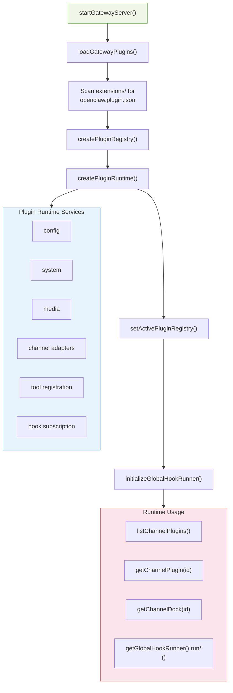
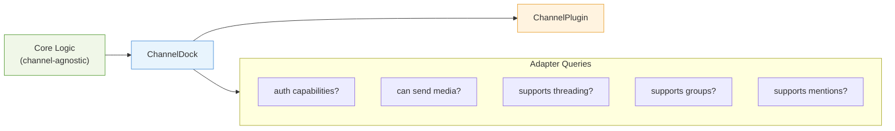
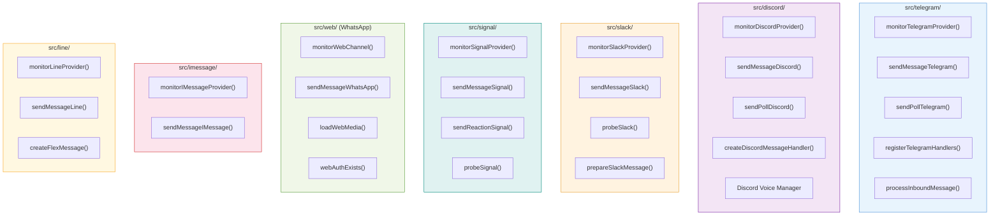
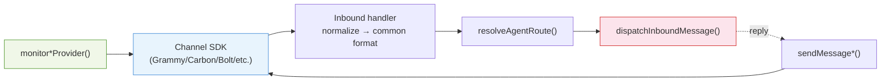

# TypeScript Analysis: Plugin System & Channel Implementations

## Plugin System Overview

---

## Plugin Type System

### 1. `src/plugins/types.ts` — Plugin Type Definitions

Pure type definitions (no runtime code). Defines the entire plugin contract.

| Type Category | Key Types | Purpose |
|---------------|-----------|---------|
| **Plugin API** | `OpenClawPluginApi`, `OpenClawPluginDefinition`, `OpenClawPluginModule` | Plugin entry point and lifecycle |
| **Runtime** | `PluginRuntime`, `PluginLogger`, `PluginConfigValidation` | Runtime context for plugins |
| **Tools** | `AnyAgentTool`, `OpenClawPluginToolFactory`, `OpenClawPluginToolContext` | Tool registration |
| **Hooks** | `PluginHookName`, `PluginHookHandlerMap`, `PluginHookRegistration` | Hook subscription |
| **Provider** | `ProviderPlugin`, `ProviderAuthMethod`, `ProviderAuthResult` | Auth provider plugins |
| **Commands** | `PluginCommandHandler`, `OpenClawPluginCommandDefinition` | CLI command plugins |
| **HTTP** | `OpenClawPluginHttpHandler`, `OpenClawPluginHttpRouteHandler` | HTTP route plugins |
| **Gateway** | `OpenClawPluginGatewayMethod` | Custom gateway RPC methods |
| **Channel** | `OpenClawPluginChannelRegistration` | Channel plugin registration |
| **Services** | `OpenClawPluginService`, `OpenClawPluginServiceContext` | Background service plugins |

**Hook event types (30+):**

| Hook | Event Type | Fired When |
|------|-----------|------------|
| `before_model_resolve` | `PluginHookBeforeModelResolveEvent` | Before model selection |
| `before_prompt_build` | `PluginHookBeforePromptBuildEvent` | Before system prompt construction |
| `before_agent_start` | `PluginHookBeforeAgentStartEvent` | Before agent turn begins |
| `llm_input` | `PluginHookLlmInputEvent` | Before LLM call |
| `llm_output` | `PluginHookLlmOutputEvent` | After LLM response |
| `agent_end` | `PluginHookAgentEndEvent` | After agent turn ends |
| `before_compaction` | `PluginHookBeforeCompactionEvent` | Before session compaction |
| `after_compaction` | `PluginHookAfterCompactionEvent` | After session compaction |
| `before_reset` | `PluginHookBeforeResetEvent` | Before session reset |
| `message_received` | `PluginHookMessageReceivedEvent` | When message arrives |
| `message_sending` | `PluginHookMessageSendingEvent` | Before message send (can modify) |
| `message_sent` | `PluginHookMessageSentEvent` | After message sent |
| `before_tool_call` | `PluginHookBeforeToolCallEvent` | Before tool execution |
| `after_tool_call` | `PluginHookAfterToolCallEvent` | After tool execution |
| `tool_result_persist` | `PluginHookToolResultPersistEvent` | When tool result is persisted |
| `before_message_write` | `PluginHookBeforeMessageWriteEvent` | Before session message write |
| `session_start` | `PluginHookSessionStartEvent` | Session starts |
| `session_end` | `PluginHookSessionEndEvent` | Session ends |
| `subagent_spawning` | `PluginHookSubagentSpawningEvent` | Before subagent spawn |
| `subagent_spawned` | `PluginHookSubagentSpawnedEvent` | After subagent spawn |
| `subagent_ended` | `PluginHookSubagentEndedEvent` | After subagent ends |
| `gateway_start` | `PluginHookGatewayStartEvent` | Gateway starts |
| `gateway_stop` | `PluginHookGatewayStopEvent` | Gateway stops |

**Invoked by:** Imported across `src/plugins/*`, `src/plugin-sdk/`, `src/agents/*`, `src/commands/*`, and all extensions.

---

## Plugin Registry & Runtime

### 2. `src/plugins/registry.ts` — Plugin Registration

| Export | Signature | Purpose |
|--------|-----------|---------|
| `createEmptyPluginRegistry` | `() => PluginRegistry` | Empty registry |
| `createPluginRegistry` | `(params) => PluginRegistry` | Full registry with registration APIs |

**Registry provides:**
- `registerTool(plugin, tool)` — register agent tools
- `registerHook(plugin, hookName, handler)` — register hook handlers
- `registerCommand(plugin, command)` — register CLI commands
- `registerHttpRoute(plugin, route)` — register HTTP routes
- `registerGatewayMethod(plugin, method)` — register RPC methods
- `registerChannel(plugin, channel)` — register channel plugins
- `registerService(plugin, service)` — register background services
- `registerProvider(plugin, provider)` — register auth providers

**Invoked by:** `src/plugins/loader.ts` (main consumer), `src/gateway/server.impl.ts`, tests

---

### 3. `src/plugins/runtime/index.ts` — Plugin Runtime Factory

| Export | Signature | Purpose |
|--------|-----------|---------|
| `createPluginRuntime` | `() => PluginRuntime` | Builds runtime with config, media, channels, routing |

**Provides to plugins:**
- Config access, media pipeline, channel adapters
- `dispatchReplyFromConfig` for custom dispatch
- `resolveAgentRoute` for routing
- `sendMessage*` functions for all channels
- Pairing store access, security helpers

**Invoked by:** `src/plugins/loader.ts`

---

### 4. `src/plugins/runtime.ts` — Active Registry Singleton

| Export | Signature | Purpose |
|--------|-----------|---------|
| `setActivePluginRegistry` | `(registry, cacheKey?) => void` | Set global plugin registry |
| `getActivePluginRegistry` | `() => PluginRegistry \| null` | Get current registry |
| `requireActivePluginRegistry` | `() => PluginRegistry` | Get or create empty |
| `getActivePluginRegistryKey` | `() => string \| null` | Cache key |

**Invoked by:**
- `setActivePluginRegistry`: `src/plugins/loader.ts`, tests
- `requireActivePluginRegistry`: `src/channels/registry.ts`, `channels/dock.ts`, `channels/plugins/index.ts`, `plugins/http-registry.ts`

---

### 5. `src/plugins/hook-runner-global.ts` — Global Hook Runner

| Export | Signature | Purpose |
|--------|-----------|---------|
| `initializeGlobalHookRunner` | `(registry) => void` | Creates global hook runner |
| `getGlobalHookRunner` | `() => HookRunner \| null` | Returns global runner |
| `hasGlobalHooks` | `(hookName) => boolean` | Check if hooks registered |
| `runGlobalGatewayStopSafely` | `(params) => Promise<void>` | Run gateway_stop hooks |
| `resetGlobalHookRunner` | `() => void` | Clear (tests) |

**Invoked by:**
- `initializeGlobalHookRunner`: `src/plugins/loader.ts`
- `getGlobalHookRunner`: `src/agents/session-tool-result-guard.ts`, `subagent-spawn.ts`, `pi-embedded-runner/run/attempt.ts`, `pi-tool-definition-adapter.ts`, `gateway/server-methods/sessions.ts`, `auto-reply/reply/dispatch-from-config.ts`, `infra/outbound/deliver.ts`, `agents/compact.ts`
- `runGlobalGatewayStopSafely`: `src/gateway/server.impl.ts`

---

### 6. `src/plugins/hooks.ts` — Hook Runner

| Export | Signature | Purpose |
|--------|-----------|---------|
| `createHookRunner` | `(registry, options) => HookRunner` | Build hook runner for a registry |

**HookRunner methods:** `runBeforeModelResolve`, `runBeforePromptBuild`, `runBeforeAgentStart`, `runLlmInput`, `runLlmOutput`, `runAgentEnd`, `runBeforeCompaction`, `runAfterCompaction`, `runBeforeReset`, `runMessageReceived`, `runMessageSending`, `runMessageSent`, `runBeforeToolCall`, `runAfterToolCall`, `runToolResultPersist`, `runBeforeMessageWrite`, `runSessionStart`, `runSessionEnd`, `runSubagentSpawning`, `runSubagentSpawned`, `runSubagentEnded`, `runGatewayStart`, `runGatewayStop`, `hasHooks`, `getHookCount`

**Invoked by:** `src/plugins/hook-runner-global.ts`

---

### 7. `src/plugin-sdk/index.ts` — Public SDK

Re-exports from internal modules for extension authors. Extensions import via `openclaw/plugin-sdk`.

**Export categories:**
- Channel types, onboarding, account helpers
- Plugin API types
- Webhook, config, SSRF, pairing, allow-from helpers
- Platform-specific helpers (Discord, Slack, Telegram, Signal, iMessage, WhatsApp, LINE)
- Media, security, infra helpers
- Gateway types

**Invoked by:** All `extensions/*` packages

---

## Channel Plugin Interface

### 8. `src/channels/plugins/types.ts` — Channel Plugin Types

| Type | Purpose |
|------|---------|
| `ChannelId` | Channel identifier string |
| `ChannelPlugin` | Full channel plugin with adapters |
| `ChannelMeta` | Channel metadata (id, label, docs, aliases) |
| `ChannelCapabilities` | Channel feature flags |
| `ChannelAuthAdapter` | Authentication and token management |
| `ChannelOutboundAdapter` | Send messages, media, reactions |
| `ChannelMessagingAdapter` | Message formatting and capabilities |
| `ChannelGroupAdapter` | Group/channel management |
| `ChannelMentionAdapter` | @mention handling |
| `ChannelThreadingAdapter` | Thread/reply support |
| `ChannelMonitorAdapter` | Connection lifecycle, event handling |
| `ChannelCommandAdapter` | Channel-specific slash commands |
| `ChannelConfigAdapter` | Channel configuration |
| `ChannelDirectoryAdapter` | Contact/user directory |

---

### 9. `src/channels/plugins/index.ts` — Channel Plugin Listing

| Export | Signature | Purpose |
|--------|-----------|---------|
| `listChannelPlugins` | `() => ChannelPlugin[]` | Sorted list of registered channel plugins |
| `getChannelPlugin` | `(id) => ChannelPlugin \| undefined` | Lookup by ID |
| `normalizeChannelId` | `(raw?) => ChannelId \| null` | Normalize via registry |

**Invoked by:** 30+ files across commands, gateway, agents, infra, security, wizard, config

---

### 10. `src/channels/dock.ts` — ChannelDock

| Export | Signature | Purpose |
|--------|-----------|---------|
| `listChannelDocks` | `() => ChannelDock[]` | Sorted list of channel docks |
| `getChannelDock` | `(id) => ChannelDock \| undefined` | Get dock by ID |

**Invoked by:** `auto-reply/commands-registry.data.ts`, `telegram/draft-chunking.ts`, `discord/draft-chunking.ts`, `reply/reply-elevated.ts`, `agents/pi-tools.policy.ts`, `reply/mentions.ts`, `reply/block-streaming.ts`, `reply/get-reply-inline-actions.ts`, `auto-reply/command-auth.ts`, `reply/agent-runner-utils.ts`

---

### 11. `src/channels/registry.ts` — Core Channel Registry

| Export | Signature | Purpose |
|--------|-----------|---------|
| `CHAT_CHANNEL_ORDER` | `readonly string[]` | Ordered core channel IDs |
| `CHANNEL_IDS` | `readonly string[]` | All core channel IDs |
| `listChatChannels` | `() => ChatChannelMeta[]` | Core channel metadata |
| `getChatChannelMeta` | `(id) => ChatChannelMeta` | Metadata by ID |
| `normalizeChatChannelId` | `(raw?) => ChatChannelId \| null` | Normalize core channel ID |
| `normalizeAnyChannelId` | `(raw?) => ChannelId \| null` | Normalize any registered channel |

**Invoked by:** Extensions, `config/plugin-auto-enable.ts`, `channels/dock.ts`, `infra/outbound/format.ts`, commands

---

### 12. `src/hooks/internal-hooks.ts` — Internal Hook System

| Export | Signature | Purpose |
|--------|-----------|---------|
| `registerInternalHook` | `(eventKey, handler) => void` | Register handler |
| `unregisterInternalHook` | `(eventKey, handler) => void` | Unregister |
| `clearInternalHooks` | `() => void` | Remove all |
| `triggerInternalHook` | `(event) => Promise<void>` | Fire event |
| `createInternalHookEvent` | `(type, action, sessionKey, context) => InternalHookEvent` | Build event |

**Invoked by:** `src/plugins/registry.ts` (via `registerHook`), hook handlers, bundled handlers

---

## Channel Implementations

### 13. Channel Monitor/Send Summary

| Channel | Monitor Function | Send Function | SDK |
|---------|-----------------|---------------|-----|
| **Telegram** | `monitorTelegramProvider()` | `sendMessageTelegram()`, `sendPollTelegram()` | Grammy |
| **Discord** | `monitorDiscordProvider()` | `sendMessageDiscord()`, `sendPollDiscord()` | Carbon |
| **Slack** | `monitorSlackProvider()` | `sendMessageSlack()` | Bolt |
| **Signal** | `monitorSignalProvider()` | `sendMessageSignal()`, `sendReactionSignal()` | Signal CLI |
| **WhatsApp** | `monitorWebChannel()` | `sendMessageWhatsApp()`, `sendPollWhatsApp()` | Baileys |
| **iMessage** | `monitorIMessageProvider()` | `sendMessageIMessage()` | Native macOS |
| **LINE** | `monitorLineProvider()` | `sendMessageLine()`, `pushMessageLine()` | @line/bot-sdk |

**All monitors invoked by:** `src/gateway/server.impl.ts` (channel startup), `src/plugins/runtime/index.ts`

**All send functions invoked by:** `src/cli/deps.ts` (lazy-loaded), `src/plugins/runtime/index.ts`, `src/channels/plugins/outbound/*.ts`

---

### 14. Channel Pattern

Every built-in channel follows the same pattern:

1. **Monitor** — start connection, register event handlers
2. **Inbound** — normalize SDK-specific message to common format
3. **Route** — resolve agent and session key
4. **Dispatch** — send to agent pipeline
5. **Send** — format reply per channel capabilities, deliver
